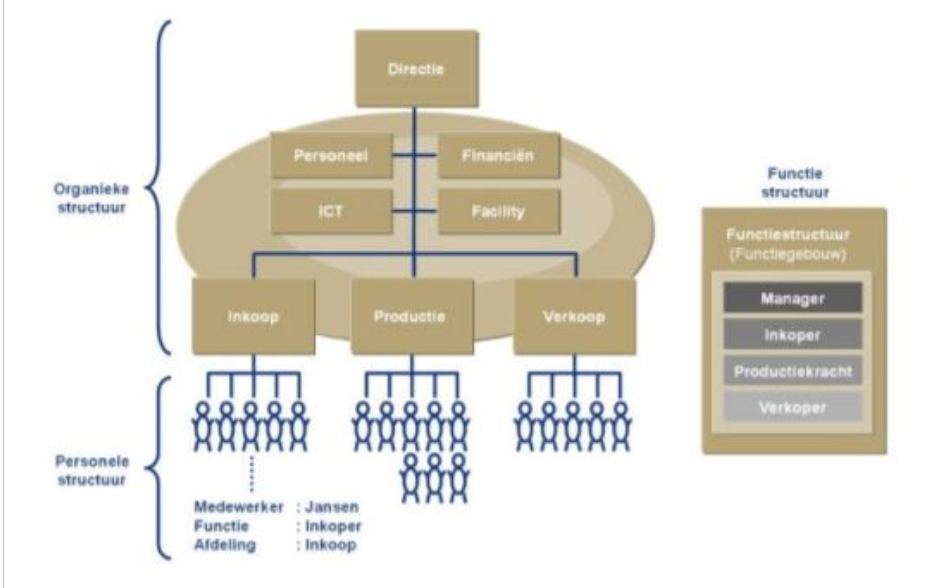
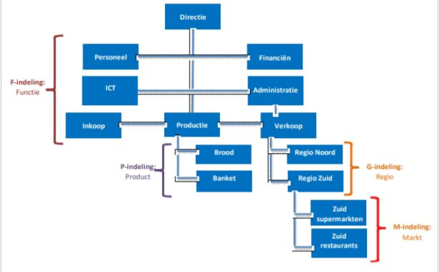
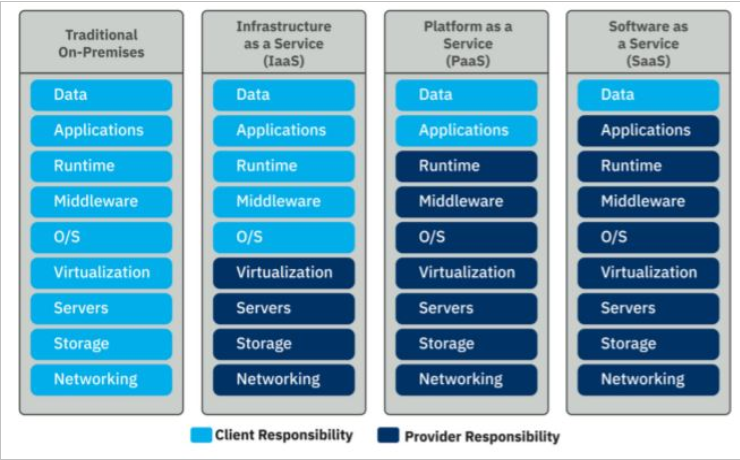

# Recensie IT Organisation en Management

### Organisatie en ICT

#### Automatisering
Het vervangen van menselijke arbeid door machines. De redenen: De som van arbeid en grondstofverbruik is kleiner na automatisering.  
Formen: 

    • Kantoorautomatisering  	     
    • Industriele automatisering
    • Grafische automatisering
    • Overige automatisering

#### Bedrijfsmanagement en beleid automatisering
De ICT structuur is een afspiegeling van de organisatie. 

`Voordeel:` hogere efficientie kan worden bereikt
`Nadeel:` kwetsbaar

Een goede samenwerking tussen IT en Management is essentieel woor succesvolle projecten. 

**7 kennisgebieden:**

    1. Algemene bedrijfsdoelen, bedrijfsfuncties/procedures en personele invulling
    2. De relatie tussen bedrijfsmatige processen met automatisering en ICT processen
    3. Juridische aspecten in samenhang met automatisering en ICT processen
    4. Welke automatisering en ICT oplossingen voorhand zijn, en wie deze levert
    5. Implementatie van automatiseringsstructuur
    6. Beheer, onderhooud, beschikbaarheid van ICT oplossingen
    7. Gebruik van ICT toepassingen door eigen medewerkers  en of relaties

Eerste drie aspecten hebben betrek tot de organisatorische aspecten en op relatie tussen management en ICT. Deze scheding is meestal ook de scheiding tussen het werkgebied van het algemeen management en de ICT specialisten. 

### De Bedrijfsorganisatie

Een organisatie bestaat uit een dynamische omgeving en heeft een relatie tussen verschillende partijen en stakeholders. Organisatie heeft invloed op zijn omgeving, en stakeholders/omgeving heeft invloed op de organisatie. 

`Cultuur:` de informele organisatie, sociale structuur van werknemers. 
`Formele structuur:` geheel van de officiel vastgestelde procedures en gezagsverhoudingen 

#### Organigram
Diagram over de taakverdeling binnen een organisatie, en hoe afstemmingen tussen de afdelingen plaatsvind. 

Er bestaan 3 verschillende vormen van een organigram: 
    • Vertical
    • Horizontal
    • Concentrisch

`Vertical:` Directie staat bovenaan, taakverdeling loopt naar beneden in hierarchische orde. 

`Horizontal:` Minder dominante weergeving. Directie staat links
`Concentrisch:` Directie in het midden, en afdeling rond om de directie

#### De organieke Structuur

De organisatie is opgebouwd rond 3 substructuren: 
    • `Functiestructuur`: beschrijving alle voorkomende functies binnen organisatie
    • `Personele structuur`: beschrijving van personele bezitting/afdeling
    • `Organieke structuur`: beschrijving van vorm van organisatie eenheden.   Afdelingen/sectoren/divisies/teams

#### De organieke structuur

De organieke structuur biedt een antwoord op de vraag hoe verschillende taken op hetzelfde nievau worden verdeeld direct onder topmanagement. Deze indelingen kunnen worden toegepast op het managementniveau, maar ook op lagere niveaus. 

**4 indelingen:** 
    • `F – indeling:` indeling naar functies, mensen worden op afdelingen gegroepeerd
    • `G – indeling:` geografische indeling: werk wat op dezelfde locatie wordt uitgevoerd
    • `M – indeling:` markt: werk gericht op bepaalde markt: kleinhandel, groothandel
    • `P – indeling:` product: het samenbrengen van de productie van een bepaald product

*Voorbeeld:*

Als we geen F-indeling kiezen als organisatie structuur, dan onstaat *divisie organisatie*, dan onstaat onder directie een P/M/G indeling. 

#### Hoofdvormen van organisatiestructuren
4 verschillende vormen: 
    1. Lijnorganisatie
    2. Lijn en staf organisatie
    3. Project structuur
    4. Matrix structuur

#### De lijnorganisatie
Dit is een structuur waarboven elke afdeling een manager of baas is. Het lijkt op een pyramide. Opdrachten gaan dan via mid-management en lager management naar benende. Uit werkervaring: Lijkt op DHL structuur in Duitsland. Iedereen in de organisatie heeft een baas, en het is duidelijk wie leiding geeft aan wie: eenheid van beveel

*Voordelen:* 

    • Duidelijk een eenvoudig. Het staat vast wie verantwoordelijk is voor wat
    • Het is duidelijk wie waar de baas is
    • Beslissingen nemen gaat snel 
    • Problemen worden snel opgelost

*Nadelen:*

    • Veel beaurocratie, de opdrachten gaan via een lange weg naar werknemers toe
    • Samenwerking is minder evident
    • Weinig ruimte voor specialisatie omdat afdelingmanagers zich volleedig moet richten op afdeling
    • Zware verantwoordelijkheid voor managers en te veel taken voor hun
    • Weinig flexibiliteit

#### De lijn en staf organisatie
Zelfde als lijn, maar naast elke directie bevind zich staf van deskundigen die buiten de organisatie staan. Een soort consultants, hun taak is te adviseren en ondersteunen. Voorbeelden van werktaken voor staf: voorbereiding voor bepaalde werkzaamheden, voorlichting geven, controle verrichten, onderzoek en productontwikkeling realiseren. 

Een stafffucntionaris kan ook **functionele bevoegheid** krijgen. Een lijnfunctionaris moet dan volledig afgaan op advies wat gegeven word. Advies = Instructies. 

*Voordelen:*

    • Er is eenheid van bevel
    • Er worden deskundigen ingeschakeld
    • Betere samenwerking tussen verschillende afdelingen
    • De taken worden minder zwaar voor lijnfunctionarissen

*Nadelen:*

    • Staf kan te theoretisch bezig zijn
    • Lijn draagt verantwoordeljkheid voor staf, inclusief fouten
    • Staf kan te veel bevoegdheid krijgen
    • Onvoeldoende kontakt tussen lijn en staf afdelingen

#### De Projectstructuur
Naast de bestaande organisatiesturctuur word een special orgaan opgedeeld wat zich bezichhoud met een specifiek project. Medewerkers worden uit verchillende afdelingen gehaald en werken voor de duur van het project alleen maar daaran. De samenstelling van werkgroepen kan wisselen naarmate het project vordert, dan zullen bepaalde teamleden uit het team stappen zodra hun werk is gedaan. 

Deze vorm is geschikt voor grote projecten. De projectleden werken autonoom en hebben alleen e projectbaas als leider. Taken en bevoegheden worden nauwkeurig omschreven, en hierarchische niveaus worden beperkt. Meestal hebben projectgroepen een adviserende bevoegdheid. 

`Nadeel:` Duur en ingrijpend is voor de organisatie, omdat de medewerkers niet aan hun normale taken kunnen werken. 

`Toepassing:` Wanneer een probleem niet in een specifieke afdeling oplosbaar is. 

`Voorbeeld:` Ontwikkeling van een nieuw product. 

#### De Matrixorganisatie
De Matrixvorm is van toepassing als de omgeving in een organisatie heel dynamisch is, en als er meestal in projectstructuur word gewerkt. Het is een vorm van permanente projectorganisatie, gecombineerd met een linorganisatie die in het algemeen functioneel is ingedeeld. 

Iedereen heeft twee chefs: 

    • Projectleider: verantwoordelijk voor het niveau en inzet van mensen in zijn afdeling
    • Functionele chef: verantwoordelijk voor “big picture”, dat het project volgens planning loopt

*Voordelen:*

    • Geschikt voor het oplossen complexe problemen
    • Kans op fouten is klein door dubbele controle
    • Deelnemers kunnen kennis en vaardigheden van elkaar overnemen
    • Makkelijk in een vakgebied te specialiseren

*Nadelen/Gevaren:* 

    • Deelnemers raken verward door tegenstrijdige belangen (funct. baas vs. Projectleider)
    •  Rapportering naar boven toe neemt veel tijd in beslag
    • Mensen moeten goed met elkaar kunnen samenwerken

### Cloud Computing

Als bedrijf is men verantwoordelijk voor de ICT infrastructuur, en dat die up to date is. Als het bedrijf groeit, moet de technologie mee groeien, en dat is soms niet zo eenvoudig. Met Cloud computing is het niet nodig voor het bedrijf om zelf hun IT te configureren. Tegen betaling van een bedrag hoeft het bedrijf geen zorgen meer te hebben over beveiliging, backups, upgrades, etc. 

#### Definitie
Op aanvraag toegang van gedeelde IT resources, betaalbaar via abbonnementen en met toegang via het internet. Het is mogelijk om toegang te krijgen naar deze technologische diensten indien je een cloud provider gebruikt. Deze cloud provider draag de verantwoordelijkheid van het beheer van deze diensten. 

Vijf belangrijker parameters die bepalen of een computeromgeving cloud based is:

    1. Universele toegang: elke soort client (GSM, laptop, tablet, etc. )
    2. Schaalbaarheid: de infrastructuur is eenvoudig uittebreiden. 
    3. Self-service op aanvraag: computer resources zoals servertijd/netwerken/opslagruimte zijn te gebruiken zonder menselijke tussenkomst.
    4. Betalen per gebruik: De gebruiker betaalt geen vast som, maar volgens zijn effectief gebruik
    5. Samenwerking: Cloud maakt samenwerking van verschillende locaties mogelijk

#### Voordelen van Cloud computing 

Situatie1: *on premise*: alles i.v.m IT ter plaatste in het bedrijf
Situatie2: *cloud computing*: alles i.v.m. IT in de cloud
    • Schaalbaarheid
    • Ruimte
    • It Experts
    • Data Security
    • Data recovery
    • Flexibiliteit
    • Automatische updates
    • Samenwerking
    • Remote Data Access
    • Implementatietijd

#### Types van Cloud Computing

    1. Service modellen worden geclassificeerd volgens het type services wat voorzien word in de cloud

    2. Deployment modellen worden ingedeeld volgens hoe en door wie de services worden gebruikt

#### Service Modellen
3 verschillende servicemodellen: 

    • Infrastructure as a Service (IaaS)
    • Platform as a Service (PaaS)
    • Software as a service (SaaS)

#### IaaS
*Levert* computer infrastructuur als een dienst door gebruik te maken van virtualisatie technologie. 

Bij Iaas zal de klant hardware resources delen met anderen. Het hoofddoel is om resources zoals servers/netwerken/opslagruimte toegankelijk te maken via applicaties en besturingssystemen. 

*Biedt:* infrastructurele services op aanvraag en gebruikt Application Programming Interface (API) voor interactie met servers, switches en routers. Eennvoudig om nieuwe items toetevoegen. 

*Beheer van gebruiker*: besturingssystem, opslagruimte, applicaties

*Service provider is verantwoordelijk voor*: huisvesting, onderhoud, werking. 

*Betaling* volgens middelend die gebruikt worden

#### Paas
*Levert* een computerplatform met software als een service zonder software downloads of installatie

*Gebruik:* Word gebruikt voor het bouwen en ontwikkelen van webgebaseerde applicaties. Het voorziet voor het ondersteunen van de volleedige software development cycle. Programmeur moet zich geen zorgen maken over de installatie en configuratie van het platform aangezien alles op het internet werkt. Service provider moet problemen oplossen. 

*Gebruikers:* vooral software ontwikkelaars en IT managers. 

#### Saas
Het proces waarbij de Application Service Provider (ASP) verschillende softwares voorziet via het internet. De klant moet niets meer installeeren op zijn eigen PC. Cloud provider zorgt voor nodige infrastructuur en de onderhoud daarvan. Ook “software on demand” genoemd, klant sluit een contract per maand af. 

De gebruiker is de eind-gebruiker van de applicatie. 

Twee voorbeelden van Saas:
    1. Google Workspace/Sheets/Docs, etc. 
    2. Dropbox

#### Verantwoordelijkheden
Naar mate men meer schuift van Iaas naar Saas nemen de verantwoordelijkheden van de cloud provider toe:

#### Deployment modellen

    • Public cloud
    • Private Cloud				
    • Community Cloud
    • Hybrid cloud

#### Public Cloud
Meerdere bedrijven kunnen tergelijkertijd gebruik maken van voorziene infrastructuur

Cloud infrastructuur bestaat nuiten firewall van de bedrijven en wordt volledig beheerd door cloud provider. 

Klanten betalen enkel voor resources die zij gebruiken

Strenge Security op de cloud die moet voldoen aan bepaalde regelgeving. Klant kan zelf geen security instellingen aanpassen. 

#### Private Cloud
Kan eigendom zijn van bedrijf, maar kan ook geleased worden en beheerd worden door dat bedrijf of derde partij.

Duurder, maar ook veiliger dan public cloud. 

Exclusief gebruik van de cloud door een organisatie. 

Cloud service providers en de klanten beheren de infrastructuur efficient met goede beveiliging. 

#### Community Cloud
De infrastructuur word gedeeld door meerdere organisaties met een gemeenschappelijk doel. Kan beheerd worden door service provider of de organisatie. De organisaties moeten een akkord afsluiten met elkaar, dardoor zijn ze verbonden. Komt minder vaak voor.

#### Hybrid Cloud
Combinatie van twee of meer van de voorgaande clouds. De privacy van het bedrijf word gewaarborgd alsook de beschikbaarheid en connectie tussen meerdere organisaties.

`Voorbeeld:` Overheid gebruikt private cloud voor persoonsgegevens, en public cloud voor algemene informatie

#### Twee grote spelers op Cloudmarkt
    1. Amazon Web Services (AWS)
    *Voordelen:* 
    • Makkelijk om meer storage aan te vragen gepast op behoefte
    • Mogelijkheid om OS te kiezen, programmeertaal, en database nar keuze
    • Makkelijkere licentie registratie

    2. Microsoft Azure
    • Mogelijkheid voor developers om applicaties te ontwikkelen en beheren
    • Grotere toepassing op enterprise needs
    • Volledige schaalbaarheid met open access over meerdere talen, frameworks, en tools. 

### Bedrijfsproces – Inkoop

Hoe bedrijven en overheden best omgaan met inkoopfunctie. Efficientie staat voorop, meetbare, kwantificeerbare en objectieve criteria zijn bijgevolg belangrijk. 

#### Definitie
Inkoop is het proces van kopen van producten, goederen, diensten. De inkoopsfunctie voorziet de organisatie met de benodigde goederen en diensten op de daarvoor bedoelde tijdstippen, uitegvoerd op de meest efficiente manier. 

Verlenging van een contract zou ook een “inkoop” kunnen zijn, dus definitie is breed toepasbaar. 

#### Inkoopsproces

Specificeren --> Selecteren --> Contracteren --> Bestellen --> Bewaken --> Nazorg en Evaluatie

#### Specificeren

    • Het uitzoeken wat de wensen zijn en welke goederen/diensten nodig zijn
    • Reactief: een eindgebruike heeft een inkoopbehoefte
    • Proactief: er wordt actief gezocht naar besparingsopportunitiet realiseerbaar via inkoop

#### Selecteren
    • Aan de hand van onderzoek kijken welke leverancier de beste producten tegen de beste prijs levert
    • Marktonderzoek doen
    • Identificatie van mog. Leveranciers
    • Informatieaanvraag
    • Offerteaanvraag
    • Offertes beoordelen
    • Leveranciers beoordelen

#### Contracteren
    • Het onderhandelen van de condities en het contracteren van de juiste leverancier. Met het contract wordt de levering van de benodigde producten zeker gesteld. 

#### Bestellen
    • Aanvraag tot bestelling (ATB) voor goedkeuring binnen onderneming zelf
    • Opstellen en opsturen van Inkooporder (AO) naar exteren leverancier

#### Bewaken
    • Kwaliteitscontrole bij ontvangst, levering of prestatie
    • Factuurcontrole
    • Bewaken van de naleving van de contractuele clausules

#### Nazorg en Evaluatie

Gebeurt door het afhandelen van eventuele klachten of afwijkingen, periodieke evaluatie vindt plaats op basis van evaluatiecriteria. 

Nuttige begrippen
Tactische inkoop
Eerste drie stappen van inkoopproces, ook offerteprocedure genoemd. Omvat het actief zijn op leveranciersmarkt.

Operationele inkoop
Stappen 4 t/m 6. Nadruk ligt op transactie, zoals het aanmaken van ATB, het autoriseren daarvan, versturen van inkooporders, ontvangen en registreren van producten en diensten. 

Sourcing
Gericht op het zoeken naar lange termijn oplossingen voor interne behoeftes en problemen. Sourcing omvat de activiteiten vanaf inkoopmarktonderzoek t/m de zekerstelling van in gang zetten van het kopen (contracteren). Dit is vaak een proactief proces, er wordt gezocht naar mogelijke inkoopopportuniteiten. Verder kijken dan enkel aankoopprijs. 

Buying
Valt samen met operationele inkoop, het verschil is het opstellen en afsluiten van het inkoopcontract. 

Purchasing
In EU en Asie: Term gebruikt voor de operationele inkoopactiviteiten (transacties), plus contracteren. Purchasing is hetzelfde als Buying. 
In US: Term gebruikt voor wat wij in deze cursus inkoop noemen, stap 1 t/m 6, maar in deze zin het reactieve proces. De eindgebruiker heeft een inkoopbehoefte en weet wat hij nodig heeft. Hij moet enkle nog beste leverancier vinden. Purchasing Department is de inkoopafdeling. 

Procurement
Is de meest gebruikte vorm van “Purchasing”, voor alle ingekochte goederen wordt proactief gezocht naar de oplossing die het meeste waarde creeert voor de onderneming. Verder kijken dan enkel de aankoopprijs.
    • Gezocht naar duurzame lange termin oplossingen die in lijn zijn met de strategie van het bedrijf
    • Sourcing is onderdeel van Procurement

Specifiek Inkoopproces
Het bovengenoemd proces is generiek. In de praktijk wordt dit proces aangepast, ingekort met extra stappen in functie met de specifieke knelpunten van de organisatie in kwestie. Waarom en hoe dit gebeurt is afhankelijk van:
    • Aard/groote van organisatie
    • Directe vs. Indirecte inkoop
    • Plaats van inkoop in de organisatiestructuur

Aard/Groote/Professionaliteit van de organisatie
    • ISO gecertificeerd  International Organization for Standardization, vastgestelde normen voor producten. Als het bedrijf ISO gecertificeerd is, is vaak in bijv. het inkooptraject vastgesteld welke stappen uitgevoerd moeten worden in welke orde.

    • Overheid  Voor overheden geldt dat ze gemeenschapsgelden zo doelmatig en integer mogelijk dienen te besteden. Belgische regelgeving is gebaseerd op Europese regelgeving. 

    • Interne Controle  In de meeste onderneming geldt de regel dat, wanneer het inkoopbedrag hoger is dan een bepaald bedrag, een bestelling goedgekeurd moet worden door meerdere personen. Men spreekt van Separation of Duties (SoD)

    • Informatisering/automatisering  Door automatiseren van werkprocessen moeten alle stappen in een inkooptraject correct doorlopen worden. Voorbeeld: ERP systemen. (Enterprise Resurce Planning

Directe vs. Indirecte Inkoop
Directe goederen/diensten (primaire inkoop): Alle goederen die direct met het eindproduct te maken hebben, zoals bijv. Suiker voor een chocoladeproducent. Ook BOM  - “Bill of Materials” genoemd
Indirecte goederen/diensten (secundaire inkoop): Alles wat het primaire proces ondersteund, zoals onderhoud, energie, kantoorartikelen, etc. NPR goederen (Non product Related)

Plaats van inkoop in de organisatiestructuur
Elke onderneming of overheid heeft haar eigen inkooporganisatie. De plaats van de inkoopafdeling bepaalt hoe er wordt aangekocht, en hoe het inkoopproces eruit ziet. De plaats van de inkoopafdeling is afhankelijk van:
    • Ontwikkelingstadium inkoopfunctie
    • Type organisatie
    • Omvang van de organisatie
    • Inkoopvolume
Er is dus sprake van wisselwerking tussen organisatie en proces
3 hoofdvormen die aan de basis liggen van elke inkoopsorganisatie:
    • Centrale inkoopsorganisatie
    • Decentrale inkoopsorganisatie
    • Gecoordineerde inkoopsorganisatie

Centrale inkooporganisatie
Bij een centrale inkooporganisatie is inkoopafdeling verantwoordelijk voor de tactische inkoop. De medewerkers van de afdeling specifieceren de producten en diensten van de interne klanten om hun behoefte te inventariseren. Het selecteren en contracteren vindt uitsluitend door de inkoopafdeling plaats. 
Voordeel: De inkoopafdeling voert de de tactische inkoopfunctie uit, behoeften worden gebundeld. 
Nadeel: Mogelijk gebrek aan draagvlak voor de contracten die door inkoopafdeling worden afgesloten. Interne klanten worden te weinig betrokken bij tactische inkoop, dus loopt de acceptatie van afgesloten contracten in gevaar. 

Decentrale inkooporganisatie
Meerdere afdelingen op tactisch en operationeel niveau in. Zonder overleg en afstemming met andere afdelingen inkopen doen. Dit autonome gedrag is een groot nadeel. Een groot voordeel is: acceptatie van afgesloten contracten. Omdat de afdeling zelf contracten afsluit, staan ze er ook achter en maken zij er echt gebruik van. 

Gecoordineerde inkooporganisatie
Neemt nadelen van centrale inkooporganisatie weg. Directie creeert een draagvlak gecombineerd met een buundeling van de behoeften binnen de totale organisatie. De tactische inkoop wordt door diverse tijdelijke multidisciplinaire inkoopteams geregeld. De afdeling inkoopcoordinatie zorgt voor het samenstellen van deze teams. Deze teams bestaan uit medewerkers ondesteund door biv. Afdeling van juridische zaken en automatiserig.
 
      Centrale inkoopsorganisatie         Decentrale inkoopsorganisatie	Gecoordineerde inkoopsorganisatie

Case Studie notities: Dit is een voorbeeld uit het cursus, belangrijke dingen zijn genoteerd
Jij bent verantwoordelijk binnen de inkoopafdeling voor “Express Services”, en jij moet ervoor zorgen, dat het bedrijf de juiste bezorgservice heeft voor de beste prijs. 
Voorbeeldbedrijf Zoetekaus N.V. werkt met verschillende leveranciers over de hele wereld. Ong. Twee derde van de pakjes worden op kosten van Zoetekauw N.V. verstuurd, de rest op kosten van bestemmeling. 
Hoe ga je te werk: 
Stap 1: Specificeren
    1. Interne Analyse uitvoeren
    2. Multidisciplinair team samenstellen
    3. Selectie en evaluatiecriteria bepalen
1. Interne Analyse uitvoeren:
Wie heeft wat naar waar verzonden tot heden?
    • Hoeveel wordt er vandaag gespendeerd aan het verzenden van pakjes?
    • Door welke afdelingen?
    • Welke type pakjes? Chocolade/documenten
    • Vanaf welke locaties
    • Naar welke bestemming?
    • Welke leveranciers worden vandaag gebruikt tegen welke tarieven?
    • Welke volumes worde er vandaag verstuurd per pakket-type?
De bron voor kwantitatieve informatie is de boekhouding. Een factuur geeft alle nodige informatie.

2. Multidisciplinair team samenstellen
Op basis van de interne analyse weet je wie geschikt zou zijn voor velke positie binnen het team. Het is vaak de Inkoopafdeling die de gegevens verzamelt en de analyse uitvoer om ze daarna te bespreken met de leden van het multidisciplinair team. 

3. Selectie en evaluatie-criteria bepalen
Op basis van welke criteria zal Zoetekauw N.V. de juiste leveranciers kunnen selecteren en evalueren? Deze criteria worden meestal duidelijk bij de ‘Interne Analyse’.  Mogelijke crieteria voor Express Services:
    • Service per vertreklocatie  leveranciers dienen in elk land even goed vertegenwoordigd te zijn
    • Aantal verschillende bestemmingen 
    • Leveringswijze en snelheid  weg/lucht/zee transport, aantal ritten, mogelijkheid om in het weekend 
    • Speciale noden zoals: gekoelde pakjes of breekbare voorwerpen
    • Technologische ondersteuning  beschikbaarheid van software om zendingen voor te bereiden
    • Track en trace
    • Verzekering in geval van verlies
    • Prijs per bestemming per pakkettype en verzendingswijze
    • Zijn er contracten uit het verleden die her-onderhandelbaar zouden zijn?

Stap 2: Selecteren
    1. Mogelijke leveranciers bepalen
    2. Offerteaanvraag (RFP) versturen (Request for Proposal)
    3. Offertes beoordelen
1. Mogelijke leveranciers bepalen
Er wordt voorlopig een “long list” gemaakt van de mogelijke leveranciers. Op basis van een informatieaanvraag, ook Request for Information (RFI) genoemd. Dit informatiedocument dient de vragen te beantwoorden van de selectiecriteria. Zou een leverancier bijv. niet de mogelijkheid hebben om naar de V.S te sturen, dan loont het zich niet om hun als leverancier te contracteren. Een RFI document informeert de leveranciers ook over de motivatie en doelen van Zoetekauw N.V. 
Op basis van de verzamelde informatie wordt een “short list” gemaakt. De shortlist is de eerste eliminatieronde. De leveranciers zullen een RFP ontvangen van Zoetekauw N.V. 
Als Zoetekauw N.V. op dit punt de leveranciers contacteert met de vraag voor hun beste prijs voor hun bezorgservice, zou Zoetekauw waarschjjnlijk links naar webpaginas, Excel sheets, emails, herhalende telefoontjes, waslijst aan vragen terug, etc . Als inkoper ben jij verantwoordelijk voor de narigheid.
Indien een leverancier niet weerhouden wordt in de short list, dient hij hierover te worden geinformeerd, misschien heeft Zoetekauw N.V. hem nodig in de toekomst. 

2. Offerteaanvraag (RFP) versturen
Bevat zeker volgende topics:
    • Voorstelling van onderneming Zoetekauw N.V.
    • Uitleg over het probleem vandaag mee kampt
    • Beschrijving van huidige situatie op basis van historische verzamelde data
    • Verduidelijking over war Zoetekauw naartoe wil
    • In welk formaat de offertes dienen ingestuurd te worden
    • De te respecteren tijdslijn
    • Betalingsmodaliteiten

3. Offertes beoordelen
De verzamelde informatie moet gekwantificeerd worden. Er wordt vaak een scorematrix gebruikt, elke leverancier krijgt voor elk evaluatiecriterium een score. De scores worden in functie van het belang gewogen, met een totaalscore die uiteindelijk bepaalt word. 

Stap 3: Contracteren
    1. Onderhandelen
    2. Contracteren

1. Onderhandelen
De fases specificeren, selecteren, en contracteren bepalen de beslissingen die worden genomen en de winsten die worden geboekt. Naarmate het inkoopproces vordert worden de onderhandelingsmogelijkheden dus steeds krapper. Eens het aankoopcontract is geteken liggen alle specificaties vast en is de ruimte nog te besparen heel klein. 
Onderhandelingen met de leveranciers vinden te alle tijde plaats onder supervisie van de afdeling inkoop. De scorematrix bepaald ook welke themas worden onderhandeld. 

2. Contracteren
Meestal bestaat er een afzonderlijke afdeling per bedrijf, genaamd ‘Legal’, die voor het opstellen van een contract verantwoordelijk is. 
    • Wat is een contract:  Schriftelijke overeenstemming tussen twee of meer partijen
    • Wat staat er in een contract:  De verplichtingen/verdeling van risico tussen opdrachtgever/nemer
    • Wat zijn algemene voorwaarden:  regels die standaard gelden zoals betalingstermijnen, garantiebepalingen, incassobedingen, etc. 

Inkoopdocumenten
    • RFI
    • RFP
Aanvraag tot bestelling
Dit is een intern document, dient eerst goedgekeurd of geautoriseerd te worden. 
Vermeld: 
    • Artikelcode
    • Omschrijving van artikel
    • Benodigde aantal
    • Gewenste datum van beschikbaarheid
    • Andere administratieve gegevens voor de boekhouding

Inkooporder/Bestelbon
Bevat zelfde gegevens als Aanvraag tot Bestelling, maar de inkooporder is voor de leverancier bedoelt. Zowel intern als extern document. Het dient enerzijds als bewijsstuk van de aankoop, anderzijds als bevestiging voor de aankoop.

Leverbon / Ontvangstbon
Van dit document wordt de ontvangts van de goederen/diensten geregistreerd en worden alle mogelijke opmerkingen die uit de hoeveelheids en kwaliteitscontrole blijken geregistreerd. 

Factuur
Op facturen in Belgie moet ten minste een van de volgende vermeldingen opgenomen worden:
    • Datum en volgnummer
    • De ID van jouw onderneming: adres van maatschappelijke zetel, BTW nummer, banknmr
    • De ID van klant: naam, adres, BTW nummer
    • Datum van belastbare feit
    • Prijs
    • Het BTW percentage
    • Vermelding van algemene voorwarden
Factuurberekeningen
BTW: Belasting over toegevoegde waarde. 

Kortingen

Handelskorting: Word gegeven om verkoop te stimuleren. Factuurkorting hoort hier ook bij, korting op het factuurbedrag, en regelkorting, korting die wordt gegeven als er een minimum aantal stuks van een bepaald product gekocht wordt. 
Financiele korting: Korting voor contante betaling (niet cash, maar voor het gegeven betaaldatum om van de korting gebruik te kunnen maken. Bijv. betalen binnen 7 dagen). 

Berekenen Factuur
Zie Oefening 1 t/m 12 voor berekeningen

Lijst met afkortingen:

ICT
IT
ERP
F – Indeling
P- Indeling
G – Indeling
M – Indeling
NIST (National Institute for Standards and Technology)
IaaS
PaaS
Saas
ISO
SoD
BOM
NPR
RFP
RFI
BTW
MvH

5 Bedrijfsproces – Verkoop

Topics die behandeld worden:
    • Def van verkoop
    • B2C vs B2B omgeving
    • Verkoop en Marketing
    • Persoonlijke verkoop
    • Organisatievormen van verkoop en marketing
    • Verkoopadministratie

Def van verkoop
    • Het leveren van goederen of diensten aan derden tegen betaling
    • Goederen of diensten van een onderneming ruilen tegen geldmiddelen van de klant
    • Het is een ruilproces

B2B vs. B2C omgeving
    • Business to Business
    • Business to Consumer
    • Consumer to Consumer (C2C)

Minder zakelijke inkopers
Een bedrijf wat goederen of diensten voor de industrie produceert zal minder klanten hebben dan een bedrijf dat in de consumentenmarkt actief is. 
    • 80/20 regel: 80% van output wordt verkocht aan 20% van de klanten, dus het belang van een enkele klant is groter dan een klant in een B2C omgeving.

De relatie koper – verkoper
De relatie is belangrijker in B2B markten. Het is zinvol voor B2B leveranciers om  te investeren in een lange-termijn relatie met klanten. Bij accountmanagement  worden speciale verkoop en marketingteams ingezet om de behoeften van de klanten te voorzien.  

B2C: voorbeeld supermarkt : klanten en producenten ontmoeten elkaar bijna nooit, en merkwisseling is bekend verschijnsel. 

Zakelijke inkopers zijn rationeler
Performante ondernemingen hanteren goed doordachte inkoopsprocessen op basis van objectieve selectie en evaluatiecriteria en concepten zoals Total Cost of Ownership (TCO).

Specificaties zakelijk inkoop
B2B: De markt worden producten vaak op specifieke wensen van klanten afgestemd. Dit is mogelijk dankzij de hoge inkomsten die met deze producten worden gegenereerd. Voorbeeld: industriele machines, treinstellen. 
B2C: aanbod wordt afgestemd op een bepaald marktsegment.

Risico’s zakelijke in en verkoop
B2B: er worden voor orders vaak contracten opgesteld. Er kunnen problemen onstaan bij de productie van zeer technische producten, voordat het verkoopsproces afgerond is. Voorbeeld: hogesnelheidstrein Fyra gebouwd in opdracht van de NMBS.

Complexiteit zakelijke inkoop
DMU: Een inkoopbeslissing wordt door een multifunctioneel team genomen, en decision-making-unit. De verkopers moeten ind it geval meedere personen van de inkopende iorganisatie benaderen. 

Belang onderhandelingen bij zakelijk inkoop
De prijslijst van de leverancier dient vaak als startpunt voor de onderhandelingen, maar de uiteindelijke prijs is in hoge mate afhankelijk van de onderhandelingsvaardigheden en machtspositie van de koper en verkoper. 

Verkoop en Marketing
Marketing
Marketing is het veroveren van de markt door het aanbod op de vraag af te stemmen en niet andersom
 Variabelen:
    • Prijs               Prijsniveau, prijsbenaderingen
    • Product         Kenmerken, verpakking, kwaliteit, aanbod
    • Promotie      reclame, publicitiet, verkoopbervordering, persoonlijke verkoop
    • Plaats             voorraden, distributiekanalen, aantal tussenschakels
Dit zijn de vier P’s van Marketing, de marketingmix

De marketingafdeling heeft als taak om de elementen van de marketingmix zo te combineren dat de vraag naar output van de onderneming naar wens is (vaak: zo hoogmogelijk). 
Een marketinggerichte organisatie onderzoekt de wensen en behoeften van de klant en speelt daarop in door producten en diensten op de market te brengen die de afnemer graag wil hebben. Met marketing bereidt een bedrijf de verkoop voor. 

Marketingconcepten
Technieken:
    • Marksegmentatie:  is het proces waarbij men klanten binnen een bepaalde markt onderbrengt in segmenten of clusters. Een marksegment is een groep van klanten die bepaalde wensen en behoeften delen en op een eenduidige manier op marketingactiviteiten reageren. 

    • Targeting: Nadat de verschillende segmenten in een markt zijn vastgesteld, kunnen de marketingsactiviteiten op de specifieke segmenten worden gericht. 

    • Positioneren: Het bedrijf gaat op zoek naar welke punten belangrojk zijn voor de consumenten. Vervolgens kan het bedrijf beslissen op welke punten het zich anders gaat verhouden t.o.v. concurrentie. 

Marketingdisciplines
    • Marktonderzoek
    • Reclame
    • Public relations
    • Branding
    • Virale marketing
Het internet kan beschouwd worden als een onderdeel van de 4 P’s. Er zijn:
    • Virtuele marketing
    • Online marketing
    • Digitale marketing
    • Sociale en mobiele media

Branding
Een sterk merk voegt emotionele betekenis toe aan een organisatie, en dit onderscheidt de onderneming van zijn concurrenten. Branding is een gevoel wat je mensen probeert mee te geven over je merk. Het vertelt een verhaal over: 
    • Wat is mijn missie, waar sta ik voor?
    • Wat is mijn persoonlijkheid, hoe bring ik dit boodschap over?
    • Hoe ga ik om met mijn klanten?

Verkoop
Def 1: Persoonlijke verkoop omvat alle persoonlijke contacten tussen het bedrijf en zijn afnemers met als voornaamste doel het afsluiten van een verkooptransactie. 
Persoonlijk verkoop is een onderdeel van het promotie-element van de marketingmix. 

Sales
Bestaat uit persoonlijke interactie, een op een verkoop maar vaak ook via telefonisch contact en netwerken. Sales is meer persoonlijk en minder op afstand zoals marketing dat is. Verkoop of sales richt zicht voornamelijk op verkoop aan bestaande klanten, en het onderhouden van deze klanten. 

Acquireren of New Business
    • Verwerven of verkrijgen van nieuwe opdrachten
    • Poging om iemand iets te laten kopen of doen
Acquireren is nieuwe klanten binnenhalen
Het is belangrijk voor iedere business om continu aan het opbouwen van nieuwe klantrelaties te werken. Acquisitie wordt gepleegd op basis van potentiele klanten van wie die marketingafdeling interesse heeft ontdenkt. 
Drie aspecten die verkopers moeten hebben: Goede overtuigingskracht, goede argumentatie, en het begrip voor de behoefte van de klant. 
Koude acquisitie: acquisitie die wordt gepleegd op basis van potentiele klanten waarvan men niets weet, cold calls bijv.  

Marketing and Verkoop
Procesmatig vormen marketing en slaes een funnel, door welke potentiele klanten worden getransformeerd in kopende klanten:
 

Aida beslissingsmodel:
Besslissingsproces:
    • Attention/Awareness: de doelgroep wordt blootgesteld aan een boodschap. Voorbeeld: Reclame

    • Interest: De doelgroep moet de indruk krijgen dat de boodschap relevant voor hun is

    • Desire: Doelgroep moet naast de interesse ook een intentie krijgen om een actie uit te voeren

    • Action: De doelgroep voer de acte uit en het doe is bereikt. 
Het AIDA model iso ok een funnel. De redenen: Bij elke stap haken een percentage af. Het hoeft niet altijd om geld te gaan. Voorbeeld: Overheid die accent legt op bewustwording, kennisvermeerdering en actiebereidheid. 
De oppervlakkge verschillen tussen Sales en Marketing:

Kwalificatie en Leads
Het AIDA model wordt gebruikt om aan te geven in welk stadium een potentiele klant zich bevindt met betrekking tot het marketing of sales proces. 

Zodra een lead qualified is, verschuift de verantwoordelijkheid van marketing naar sales. De kwalificatie van leads is een samengesteld process van beide kanten. 

Proces van persoonlijke verkoop

Prospecteren
Een proscpect is een iemand die niet eerder producten van het verkopende bedrijf heft afgenomen, maar toch interesse heeft getoond in je product en/of onderneming. 
Het contacteren van nieuwe klanten. Hier zouden cold calls kunnen plaatsvinden. 

Analyseren
In geval van interesse word ten verkoopsgesprek gepland, de klant en zijn behoeftes wordt verder bestudeerd.

Benaderen
Tijdens de fase van het benaderen wordt de eerste indruk van het verkoopgesprek gemaakt. 

Presenteren
Deze fase kan bestan uit 1 of meerdere presentaties. Potentiele klanten worden bijv uitgenodigd om het productieproces of toelereingsketen te bekijken. 

Bezwaren overwinnen
Bezwaren zijn vragen of bedenkingen over het prodcut, de dienst of het verkopende bedrijf. Door bezwaren in kaart te brengen kan men inzicht krijgen in onuitgesproken wensen van de klant. 

Contracteren
Het formele document waarin de klant zich verbindt het product/de dienst te kopen. 

Opvolgen
Opvolgen of de klant tevreden is/blijft. Wordt alles wat verwacht of beloofd werd ook effectief geleverd? Dit vormt de basis voor een langdurige samenwerking. Als een tevreden klant mond tot mond reclame verbreidt (ook referrals genoemd).

Organisatievormen van verkoop en marketing
Afhankelijk van de grootte van een onderneming en het belang dat aan marketing en/of sales wordt toegedicht, zijn er verschillende organisatiestructuren mogelijk. 

Sales, Sales en Marketing, Marketing
Met groei komt ook de nood om verkopers meer te ondersteunen, vaak wordt daarom een marketing specialist toegevoegd aan de verkoopafdeling. 
Bij Sales en Marketing: Wanneer een onderneming successvol wordt, zal de verkoop meer voorbereiding eisen. De marktsegmentatie, targeting en positinering dringen zich op. Op dat moment wordt marketing ook een aparte organisatiefunctie naast sales. (diagram 3)
Bij Marketing: Naarmate het bedrijf groeit, groeien Marketing en Sales mee elk in hun specialiteiten. 
            Sales			                             Sales & Marketing
                           
         Marketing

Marketing overstijgt Sales in reikwijdte. We merken wel op dat in tijden van crisis en besparingen marketing eerder in het vizier komt dan Sales. Dit komt omdat de bijdrage tot het bedrijfsresultaat van Sales makkelijker is om aan te tonen dan dat van Marketing. 

	
Verkoopadministratie

Er zijn een aantal documenten verist om het verkoopproces succesvol af te ronden. Documenten:
    • Offertes
    • Bestellingen
    • Leveringsbon
    • Factuur
    • Creditnotas
    • Inning en boekhoudkundige registraties

Offerte (Sales Quotation)
Een offerte is een formele aanbieiding van producten, diensten of werkzaamheden. Een offerte wordt over het algemeen opgesteld op verzoek van een potentiele klant van een bedrijf. 
Een offerte bevat:
    • Da naam en/of maatsch. Benaming, het adres, evt. Handelsregisternummer of ambachtsregister
    • Beschrijving van de te leveren producten of diensten
    • Een prijs. Kan vast of verrekenbaar zijn (bijv. Per uur) Incl./Excl. BTW wordt aangegeven. 
    • Evt. Van toepassing zijnde betalingscondities en kortingen
    • Datum en geldigheidsduur van de offerte
    • De schatting van de duur van uitvoering, met daarin aangegeven onder welke voorwaarden de planning gehaald wordt. 
    • Voorwaarden. Er kan worden verwezen naar algemene voorwaarden
    • Geldige ondertekening. 

Bestelling (sales order)
De overeenkomst is echt als de tegenpartijd/consument schriftelijk zijn toestemming geeft, door te ondertekenen, dan spreken we van een bestelling. Extra controles die mogelijk kunnen plaatsvinden hier:
    • Commerciele aspecten (kortingen, betalinsgscondities, prijs) door de verkoopleiding
    • Kredietwaardigheid van de klant

Leveringsbon (delivery note)
Bestelling wordt doorgegeven aan de operationele afdelingen. Goederen worden iut stock genomen en klaargemaakt voor expeditie. 
De leveringsbon bevat alle nuttige informatie om intern de levering te kunnen voorbereiden en het transport te verzekeren. Leveringsbon dient bij afvoering ondertekend geworden door klant.

Factuur (A/R invoice)
De factuur is het document dat de vorderingen vaststelt en bij voorkeur afzonderlijk wordt verstuurd naar de klant. 

Creditnota (A/R credit memo)
Creditnota wordt opgesteld in geval van retourzendingen of klachten vand e klant, fouten in de facturatie/kortingen.
De eerder uitgeschreven factuur wordt geheel of gedeeltelijk gecompenseerd, waardoor deze wettelijk gezien dezelfde informatie bevat als de factuur. 

Inning en beokhoudkundige registraties
De boekhouding verzorgt de registratie van de verkopen, en bewaakt de tijdige inning van de vorderingen. 

	
Chapter 6 – E-Commerce
Trends worldwide
    1. Worldwide: are phones used more than PC’s?
more internet users by phone than PC.
As population grows, mobile phone users grow, PC users grow faster, social media users grow as well

2.    Which continent uses the most internet?
       Asia largest internet user with 53.4%
       Ranking: Asia, Europe (14.3%), Africa, Lat America, North America, Middle East, Oceania
    3. Which country spends most time on internet?
Philipines and Brazilians spend most time on internet with 11 hours in total per day, vs. Europeans who spend around 6-5.5 hours per day on internet.

    4. Daily internet time using mobiles: Trend: 
the older the age, the less time using mobile devices. Females spend more time on phones than males in all age categories

    5. Share of web traffic by device, change in one year:
Mobile phones: Increase
Laptops and Desktops: Decrease
Tablets: increase
Other devices: unchanged

    6. Ecommerce adoption by age and gender:
More or less equal, a little less in the oldest section, and females just a little higher than men. 

    7. Ecommerce adoption worldwide 
average: 77% of people bought something online in the last month. 

    8. Mobile ecommerce adoption:
Trend: The older the person, the less likely they order online with phone, females order more by use of phone than males. 

    9. Global ecommerce growth by category: 
Travel is biggest category, followed by fashion and beauty
Trend: Every category went up last year, except travel, due to lockdown. 

Trends in Belgium
    1. Annual Digital Growth
Mobile users: small growth, internet users larger growth, social media users 11% growth

    2. Daily time spent on media
Most time goes to general internet use, second place: watching and streaming, third place: social media

    3. Device ownership
1st place: mobile phones, 2nd place: smart phone, 3rd place: laptop/desktop

    4. Ecommerce activity
Most people searched online for something, a little less of them visited an online store, around 50% used a shopping app, around 75% bought something online, and only 31% used a phone to purchase online

    5. Ecommerce purchases by age group
The age group spending most online is 35-44, then after that 45-54 year olds. The oldest age group is lowest as usual. 

    6. Ecommerce growth by category
Travel: Went down by 51%
Fashion & Beauty: Went up by 17%
Electronics: up by 12%
Food & Personal care: up by 27%
Furniture: up by 19.2%
Toys, hobbies: up by 17%
Digital music: up by 25%
Games: up by 26%

Meerwaarde van een website
Met een website worden de volgende doelstellingen voor een bedrijf bereikt:
    • Naamsbekendheid vergroten
    • Bezoekersaantal vergroten
    • Bezoekduur van bezoekers verlengen
    • Klanttevredenheid vergroten
    • Van bezoekers klanten maken
    • Vragen van klanten beantwoorden op de website
    • Loyaliteit verhogen

Online marketing funnel
Bij online verkoop is het AIDA model ook toepasselijk. 

Search Engine Marketing (SEM)
SEM is het commercieel benutten van de werking van zoekmachines. Het doel van SEM is om mee ren relevant verkeer naar de website te krijgen. 
SEM bestaat uit 2 onderdelen: 
    1. Search Engine Advertising – SEA   zoekmachinemarketing. SEA is het kopen van een hoge positie in de gesponsorde resultaten van een zoekmachine. 

    2. Search engine Optimization – SEO   proberen hoog te scoren in de natuurlijke zoekresultaten, aanhand van een goed geprogrameerde website, relevante inhoud, goede structuur. 
Seach Engine Optimisation – SEO
Een ‘robot/crawler’ doorzoekt de paginas binnen websites op de gebruikte termen en informatie. De gevonden informatie wordt door middel van analyse gerangchikt op relevantie. Een organisatie die een site laat bouwen moet dus goed bekijken hoe de vindbaarheid is van de website op de termen gehanteerd door de zoekmachine. 

De website moet zo zijn ingericht dat de zoekrobot de informatie kan verzamelen en naar de zoekmachine kan sturen. 

Inhoud
Zoekwoordrelevantie is de mate waarin de getoonde website relevant is voor de zoeker. Bij SEO is de click-through-rate (CTR) een belangrijke indicator voor de relevantie. Hoe hoger de CTR, hoe relevanter en interessanter de wbesite is voor de zoeker. 

Programmeertechnieken
Een robot leest onder anderen de metatags, dus als die op de juiste plek zijn, en er ontbreekt niks, dan is dat goed voor de relevantie van de website
De robot checkt:
    • Geoptimaliseerde URL’s: voorbeeld.be/p=?12397 wordt aangepast naar voorbeeld.be/seo‐checklist
    • Security: Een veilige website heeft een SSL-certificaat: https ipv. http. 
    • Responsive website: op maat toepasbaar aan de device
    • XML sitemap: In deze sitemap staan alle mogelijke paginas/URL’s van de website
    • Robots.txt Dit bestand wordt gebruikt om bepaalde sectie binnen uw website af te schermen voor zoekrobots. 
    • Laadsnelheid

Populariteit
Def: het aantal links dat van externe sites naar de site gemaakt zijn. Ook backlinks genoemd. Deze aanbeveling noemt Google de PageRank, wat leidt naar een cijfer tussen 0 en 10. De kwaliteit van de aanbeveling is van belang. 

Orderafhandeling
Bedrijven die een online winkel hebben, hebben vaak ook een fysieke. Er zijn dus meerdere distrubutie mogelijkheiden. 
Proces van online aankopen
Standard inkoopproces van een product online. 

Basismodellen voor distributie
Er zijn twee soorten basismodellen. Het product komt naar de klant toe, of de klant gaat het product ophalen. Bij bezorging zijn er twee distributimodellen: Persoonlijk en niet persoonlijk. 

Voordelen van online shopping:
    • De klant heeft beter overzicht van het gehele assortiment, incl beschikbaarheid en leveringstermijnen
    • De klant beschikt vaak over meer producten
    • De klant kan prijzen van verschillende winkels vergelijken
    • Het shoppen is gepersonaliseerd
    • Online winkelen is gemakkelijk
    • Reviews

Voordelen van ophalen
    • Klant kan alle zintuigen gebruiken bij het keizen van een product
    • Klant moet slechts betalen bij ontvangst
    • Indien gewenst is er persoonlijke interactie
    • Het product kan worden meegenomen
    • Fun factor (Shopping experience)

Keuze van distributiekanalen
Risicoperceptie speelt een rol bij het kiezen van distributiekanaal, als de kans groot is voor een retour, dan zal dat het distributiekanaal beinvloeden. Als iemand precies weet wat hij nodig heeft, dan kiest hij voor het internet. 
Kanaalconflict kan worden vermeden indien men:
    • In een webwinkel leads genereren voor een fysieke winkel
    • In de webwinkel bestelde artikelen te laten leveren door de fysieke winkel
    • Uniforme prijzen te hanteren. 
Synergie vs. Kannibalisatie:
Synergie is het versterken van kanalen. Voobeeld: de afhandeling van retouren. Bij online bestelingen komen deze vaak voor. De kosten van retouren kunnen zo hoog zijn dat ze het online kanaal onaantrekkelijk maken. De aanwezigheid van een fysieke winkel waar ze terecht kunnen met retouren zullen de retourkosten doen dalen. 

Kannibalisatie: Vaak blijkt dat het invoeren van een nieuw distributiekanaal de omzet van het oorspronkelijke kanaal terug laat vallen voor enige tijd. 

Omnichanneldistributie
Fysieke winkels scoren vooral goed op de mogelijkheid de eigenschappen van het product te beoordelen, het product snel in bezit te krijgen, probleemloos te ruilen. Online heeft de voorkeur als het gaat om veilig betalen, klantenservice, prijsniveau, en uitgebreidheid van het assortiment. 
Door een combinatie van kanalen te gebruiken, kunnen aanbieders beter inspelen op de behoeften van de klanten. De nadelen van het ene kanaal kunnen die van het andere kanaal compenseren. 

Belangrijke beslissingen die bedrijven moeten nemen voor multichanneldistributie:
    • Moeten de prijzen even hoog zijn?
    • Voeren de kanalen hetzelfde assortiment
    • Hoe wordt de voorrad beheerst
    • Gelden dezelfde verkoopvoorwaarden, is er identiek retourbeleid?
    • Kunnen online ankopen in de winkel worden geretourneerd?
De aanpak is dus flexibel. Het strategische einddoel is omnichanneldistributie: de distributie van een verkooporgainsatie via meerdere kanalen, waarbij de kanalen naadloos met elkaar zijn verbonden. 

Backoffice
Om goede omnichanneldistributie mogelijk te maken, moet de backoffice van elk distributiekanaal afgestemd zijn. 

Frontoffice: is het gedeelte van de organisatie waarmee de klant in contact is
Backoffice: ondersteunt de medewerkers en de processen in het frontoffice

Vaak wordt ervoor gekozen om een beperkt en relevant gedeelte uit het backoffice te tonen in de frontoffice, bijv. ”Duik in het assortiment” – tablet met vooraadinzicht binnen winkel. 
Fysieke winkels die uitbreiden met online moeten hun orderadministratie met hun vorraadbeheer volleedig integreren. Omdat websites van online dienstverleners grote volumes aan bezoekers krijgen zijn de technische eisen heel hoog:
    • Vaak wordt er gewerkt met een beschikbaarheid van 99,95%. Serverparken worden dubbel uitgevoerd en wanneer er een storing is zal automatisch worden geswitched naar een andere serverpark. 
    • De websites moet door alle browsers worden ondersteund, maar ook toegankelijk zijn voor visueel gehandicapten. 

Chapter 7 – ERP-systemen

ERP = Enterprise Resource Planning: geintegreerd standard softwarepakket wat alle transactie en processen van de bedrijfsvoering ondersteunt, over de afdelingsgrenzen heen. 
Voordeel van ERP systeem:
    • Gegevens van bijv klanten en producten binnen organisatie moeten slechts eenmal ingevoerd worden
    • Efficientere manier van werken
    • Betere communicatie
    • Kostenverlaging

Modules
Niet alle domeinen zijn onafhankelijk van elkaar. Een bepaald bedrijfsproces kan in verschillende domeinen verankerd zijn. Door deze verankering in verschillende domeinen vind je bepaalde items in een aantal domeinen terug. Bijv: Artikelen vind je onder andere in PRODUCTIE, PRODUCTONTWERP, INKOPEN, PLANNING, MAGAZIJN, PLANNING EN UITVOERING, SERVICE, en CONTRACTBEHEER. 

Gegevens selecteren en filteren
Binnen een factuur of document kan men boven rechts met hulp van de filters zoeken plegen. Alle filters kunnen ook verwijderd worden door rechts op het x te klikken bij de filtres. Om de kollommen uittebreiden RM klik bij de kolommen, selecteer kolommen kiezen

Overzicht van toepasbare filters:
Betekenis
Voorbeeld
Wat?
Gelijk aan
987
Man
Alles 987
Records met de code ’man’
Interval
540..678
..987
P6 ..
Nummers 540 t/m 678
Nummers t/m 987
Gegevens van boekhoudperiode 6 en verder
Of
45|67
Records met nummer 45 of 67
En
< 2000 & > 
1000
Nummers kleinder dan 2000 en groter dan 1000
Behalve
<> 0
Alle nummers behalve 0
Groter dan
> 1000

Groter of gelijk aan
>= 1000

Kleiner dan 
< 1000

Kleiner of gelijk aan
<= 1000

Onbeperkt aantal onbekende tekens
*nr*
*nr
Nr*
Tekst met de letters ’nr’
Tekst die eindigt op ‘nr’
Tekst die begint met ‘nr’
Een onbekend teken
Goova?rts
Tekst zoals Goovaerts of Govaarts
Case insensitive
@veldnaam
Tekst zoals ‘veldnaam’, ‘Veldnaam’, ‘VeldNaam’, ‘velDnAam’

Enkele voorbeelden:
    • 5999|8100..8490 – alle records met nummer 5999 of een nummer van 8100 – 8490.
    • ..1299|1400.. – records met nummer kleiner of gelijk aan 1299, of groter of gelijk aan 1400. 
    • *C*&*D* - Tekst met tekend C en D
    • @*bo?* - tekst met de tekens ’bo’, ’BO’, ’bO’, ’Bo’. De tekst moet voorkomen gevolgd door ten minste een teken.

Datumgegevens
Datums invoeren
Kunnen of 01012020 of 01/01/2020. Datum kan twee, vier, zes, of acht tekens bevatten. Als je twee cijfers invoerd wordt dit als een dag beschouwd, en wordt maand en jaar automatisch toegediend. Bij 4 cijfers wordt het jaar automatisch toegediend. Als de ingevoerde datum tussen de periode 01/01/1930 en 31/12/2029 valt, dan hoef je geen slechts twee cijfers voor het jaartal in te voeren. 

Weekdagen zijn ook geacepteerd, gevolgd door weeknummer: Ma25 = maandag in week 25. 
H – datum van vandaag wordt ingevoerd
W – werkdatum wordt ingevoerd

Via de assistbutton van NAV kan je de werkdatum instellen. Als je deze niet instelt, wordt de systeemdatum als werkdatum gebruikt. Het gebruik van een werkdatum is handig als je veel transacties hebt met een andere datum dan de huidige. 

Datumformules gebruiken
Met datumformules kun je bepalen hoe datums moeten worden berekend. 
    • De datumformule in het veld RESPIJTPERIODE van een bepaakd aanmaningsniveau bepaalt hoe lang de vervaldatum moet zijn verstreken voordat een aanmaning wordt aangemaakt

    • De datumformule in het veld VERVALDATUMFORMULE bepaalt hoe de vervaldag voor de aanmaning wordt berekend. 

Datumberekeningsformule mag max 20 tekens hebben.
    • L – Lopend
    • D – Dag
    • W – Week
    • M – Maand
    • K – Kwartaal
    • J – Jaar
Er zijn drie soorten datumformules:
    • Lopend plus tijdseenheid. Voorbeeld: 
- LW – Lopende week
- LM – Lopende maand
    • Een nummer plus een tijdseenheid. Nummers mogen niet groter zijn dan 9999. Voorbeeld:
- 10D – 10 dagen vanaf vandaag
- 2W – 2 weken vanaf vandaag
    • Een tijdseenheid plus getal. Voorbeeld:
    • D10 – de volgende tiende dag van de maand
    • De volgende vierde dag van een week (donderdag)
Je kan drie soorten combineren. Voorbeeld:
    • LM + 10D – lopende maand + 10dagen
Je gebruikt een mintekenom een datum in het verleden aan te duiden. Voorbeeld
    • -1J – 1 Jaar geleden vanaf vandaag

Chapter 8 – ERP systeem Inkoop
De artikelkaart
De mogelijke verschillende velden van de Waarderingsmethode:
    • FIFO: First In First Out – de waarde van goederen die op een bepaald ogenblik verhandeld worden, wordt bepaald door de goederen die het eerst binnen kwamen

    • LIFO – Last In First Out – de waarde van de goederen die op een bepaald ogenblik verhandeld worden, wordt bepaald door de goederen die het laatst binnen kwamen;

    • SPECIFIEK: specifiek voor een bepaald artikel

    • GEMIDDELD  - gebaseerd op alle aankopen

    • VAST: de kost per eenheid wordt door de gebruike bepaald

Het veld kostprijs is vooral van belang in producerende bedrijven waar de kostprijs afhangt van de prijs van grondstoffen, werkuren, enz. Bij de Financiële details moeten een aantal items ingesteld staan om de boekingen mogelijk te maken. Het gaat om PRODUCTBOEKINGSGROEP, BTW‐PRODUCTBOEKINGSGROEP en VOORRAADBOEKINGSGROEP.

Het inkoopproces

Als men een behoefte detecteert (specificeren), zijn er 3 mogelijkheden binnen NAV2017: 
 een inkoopvoorstel lanceren 
 offertes rondvragen en een leverancier selecteren 
 een raamcontracten opstellen (contracteren).    

Een bestelling (inkooporder) kan vervolgens voortvloeien uit een inkoopvoorstel, een offerte, of een raamcontract. Een offerte aanmaken of invoeren doe je via INKOPEN, ORDERVERWERKING, INKOOPOFFERTES. Rechts naast de tab ALGEMEEN is een raadpleegmogelijkheid voor bepaalde leveranciersgegevens opgenomen. In de offerteregels kunnen verschillende artikelen in dezelfde offerte worden opgenomen. Rechts naast de offerteregels is een raadpleegmogelijkheid van artikelgegevens weergegeven, zoals de beschikbaarheid. De gegevens worden meteen uit de ERP‐ database opgehaald. Bij het ORDERLEVERANCIERSNR selecteer je de nummer toegewezen aan de leverancier bij de leverancierskaarten. Kies in de rubriek REGELS in het veld SOORT de optie ARTIKEL. Kies een artikel en vul het aantal artikelen dat besteld zou worden, in. 
Dit doe je door in het tabblad ACTIES bovenaan te klikken op ORDER MAKEN (bestellen). Hierbij is het INKOOPORDERNUMMER de sleutel. Zo worden goederenontvangsten en factuurontvangsten alle gekoppeld aan de daarbij behorende inkooporders.  
Kortingen bij inkopen
Regelkorting: wordt gegeven als een minimale hoeveelheid van een bepaald artikel aangekocht wordt. 
Factuurkorting: wordt gegeven op het factuurbedrag
Bij acties, testrapport kan men checken of de kortingen werden toegepast

PROJECT MANAGEMENT
Les 1
Kenmerken van een project
    • Uniek
    • Specifiek eindresultaat
    • Start en einddatum
We starten dus een project op, omdat we iets nieuws moeten maken, opleveren of bouwen.
Operations: doen het bedrijf draaien
Projecten: Brengen vernieuwing

Terminologie:
    • AS-IS: huidige situatie
    • TO-BE: toekomstige situatie
    • Scope: de inhoud van een project, bepaalt wat er door het project wordt opgeleverd
    • Benchmark: een afgesproken vergelijkingspunt zoals een concurrentieel system of een standard in de markt
    • Requirement: de individuele vereisten die aan het te bouwen systeem opgelegd worden, m.a.w. de details van de scope.
- functional: directe waarde voor eindgebruiker
- non-functional: veiligheid, schaalbaarheid, stabiliteit, onderhoudbaarheid, etc.
    • Change request : een vraag tot wijziging, die niet was opgenomen in de oorspronkelijke scope(offerte).
    • Deliverable: is een finaal of tussentijds product dat wordt opgeleverd als resultaat van een projectactiviteit
    • MVP/Minimal Viable Product: de kleinste, werkbare deliverable die aan de eindgebruiker opgeleverd kan worden
    • UX/User eXperience: definieert het gedrag en het uitzicht van het systeem naar de eindgebruiker toe
    • Resource: een element wat nodig is om een bepaalde activiteit te voltooien.
    • Milestone: momentipname op de projecttijdlijn 
    • TCO/Total cost of Ownership: de som van alle kosten, zichtbaar en onzichtbaar, direct/indirect over de levensduur van het project
    • ROI/Return on Investment: de winst die gemaakt wordt door een project over langere termijn na aftrek van de totale kosten

Problemen in de uitvoering van projecten
Anti-patterns: hoe goed bedoelde structurering tot verkeerde resultaten kan leiden
Voorbeelden: Communicatie/Transparentie, Oogkleppen en werken in isolatie, bedrijfstructuur
Wanneer is het project succesvol?
Klant
    • Op tijd
    • Juiste scope
    • Binnen budget
Project manager
+ Prestaties in lijn met het project management plan

Bedrijf
+ 
    • Effectief gebruikt
    • ROI behaald na x maanden
    • Bijdrage tot strategische doelen

Waarom projectmatig werken?
    • Duidelijk doel op efficiente manier bereiken
    • Duidelijke afspraken maken
    • Resultaat bereiken binnen afgesproken periode
    • Team vormen met kennis die nodig is om resultaat te bereiken
    • Budget controle
    • Opvangen van onverwachte situaties en beheer van risicos

Ontstaan van een project

Hoe onstaat een project? (Requirements/Feasability)
Oplossen van een problem of gebruik maken van een opportunitiet om processen te optimaliseren of vernieuwing te brengen. Dit kunnen bedrijfsprocessen, processen van de klant, of processen van afdelingen/medewerkers zijn.

Interne projecten
    • Factoren van buitenaf. Voorbeeld: General Data Protection Regulation, Y2K.
    • Optimalisatiebehoeften (top-down): Verlagen kosten, verhogen omzet
    • Optimalisatiebehoeften (bottom-up): Verbetering proces of de werkvloer

Business case
Geeft aanbeveling aan beslissingnemers om actie te ondernemen, het biedt een antwoord op de vraag of een project winstgevend zal zijn op de middellange of lange termijn. 
    • Duidelijke doelstellingen
    • ID van het probleem (AS-IS, process beschrijvingen)
    • Oplossingen en benchmark studie
    • Analyse van voordelen en risico’s
    • Haalbaarheidsstudie (technologie, architectuur)
    • Financiele analyse (ROI, Net Present Value, Payback Period)
    • High level planning

Externe leveranciers – Benchmarking
De meeste business cases hebben nood aan: Vroege vergelijkende studie van oplossingen van verschillende leveranciers (benchmarken), en vroege high level inschattingen van leveranciers, timing, en kosten. Mogelijk wordt hiervoor een RFI (Request for Information) opgestart. Dit wordt uitgestuurd naar mogelijke leveranciers, 

Resultaat van de business case

Wat is project management
Def: een discipline die noodzakelijk is om het actieplan uit te tekenen, uit te voeren, en te bewaken. 
Competenties van de project manager :
    • Plannen : het project opstellen
    • Kennis van financien : om de budgetten te kunnen opvolgen
    • Time management: prioriteiten kunnen stellen
    • Risico management: proactief risicos inschatten en hierop reageren
    • People management: met teams kunnen omgaan
    • Conflict management: conflicten oplossen
    • Communicatie
    • Stress management

Planning
De projectplanning is een dynamische verzameling van tools en documenten die de projectmanager gebruikt om het verloop van het project voor te stellen, op te volgen, en bij te sturen wanneer nodig. 
    • Resources
- Wie (team
- Waar(locatie en faciliteiten)
    • Time
- Wanneer
- Hoelang

Deliverables van de Planning
    • WBS/Work Breakdown Structure
- Hierarchische voorstelling van de verschillende deliverables binnen het project moeten uitgevoerd worden
- Deliverables worden opgedeeld in werkpakketten
- Geen details (zoals afhankelijkheden tussen werkpaketten)
- Gebruikt oa voor facturatie en tijdsregistratie

    • GANTT Chart – gedetailleerde planning van taken en activiteiten

    • Kick-off meeting
- Voorstel project plan aan teamleden
- Verdere planning bespreken

                                			
      WBS

     GANTT

Ontwikkelingstrategien

Project Management Methodologieen

