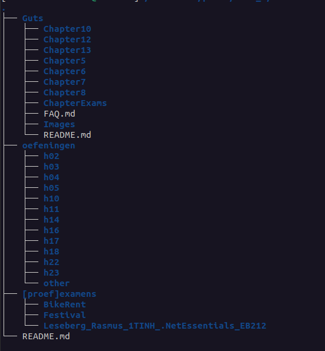

# .NET Essentials 

### Year: 2022

This directory contains exercises from the .NET Essentials course from PBTIN year 2021-2022. The exercises are split into three categories: 

    * Guts
    * exercises from the book (oefeningen)
    * [proef]examens 

`[proef]examens` contains two practice exams as well as the final exam from that year. A third practice exam called `PixelPass` is located in the *Guts/ChapterExams* directory.

**Exam Score:** 14

Directory contents:

