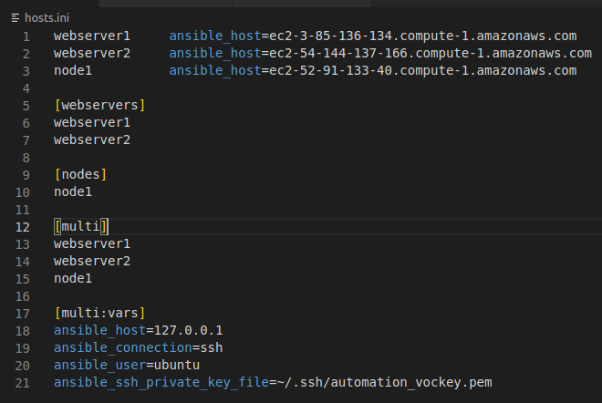

# Installing Docker and Nginx on EC2 instances

## Setup of files

### Hosts.ini

**Note** Using the public DNS Ipv4 names to reach EC2 instances. 
**Note** SSH connectivity needs to be established before, and chmod 400 on vockey.pem was also necessary

*hosts.ini:*

**Note** If the hostnames in the hostfiles are different than the EC2 instance names in AWS the playbook will still run. Correct public IPv4 and usernames is important.

### Run playbook command

**Test connectivity**:
ansible multi -m ping

**Run playbook**:
ansible-playbook playbook.yaml

Run multiple times to check idempotency
