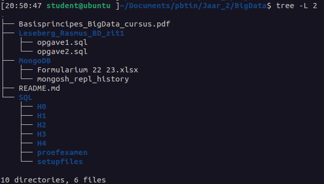

# Big Data

### Year: 2022-2023

This directory contains exercises from the Big Data course from PBTIN year 2022-2023. The contents are split over different directories: 

    * exam
    * sql exercises
    * mongosh history
    * Basisprincipes pdf

`SQL` contains H1-H4 and almost all complete and checked SQL exercises for each chapter. `MongoDB` contains the mongosh_repl_history with all executed commands. These are mostly the exercises from the course, along with some testing. 

The Basisprincipes pdf contains highlighted text that appears on the theory exam (10% of exam).

**Exam Score:** 16

#### Directory contents:

