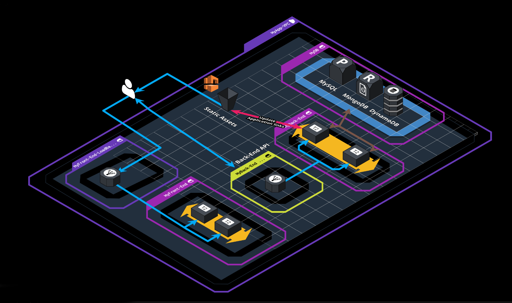

# PE Opdracht Cloud services 1 22-23

## Applicatie informatie

De hogeschool wil een Todo applicatie voorzien voor alle studenten. 

De applicatie bestaat uit een [3-tier web app](https://en.wikipedia.org/wiki/Multitier_architecture) gebouwd in Angular als frontend, NodeJS (+express) als backend gekoppeld aan een databank. 

De applicatie bevindt zich in deze repository en bestaat uit 4 actieve branches: **[https://github.com/2TIN-CloudServices1/CloudToDoApp](https://github.com/2TIN-CloudServices1/CloudToDoApp)**

 Deze 4 branches hebben impact op de gebruikte database binnen de applicatie:

* Main: Deze branch maakt gebruik van MongoDB als databank met het ORM mapping framework mongoose. **Deze branch wordt niet gebruikt voor deze opdracht**
* Sequelize: Deze branch maakt gebruik van MySQL als databank met het ORM mapping framework sequelize.
* Dynamo-db: Deze branch maakt gebruik van AWS DynamoDB als databank. **Deze branch wordt niet gebruikt voor deze opdracht**
* Serverless: Deze branch maakt gebruik van API Gateway gekoppeld aan Lambda functies en met DynamoDB als databank

**health check:** De backend bevat een health endpoint die gebruikt kan worden als health check indien nodig. 

Daarnaast bevat de backend ook een endpoint /carrousel die de url’s van de images teruggeeft die gebruikt worden in de frontend.

**Initiele Setup:** Dockerfiles & docker-compose file zijn gegeven. Hiermee kan je reeds aan de slag om de applicatie te testen. Je begint best ook met een lokale setup vooraleer je gaat kijken naar een deployment in de cloud. Voor de deployment moet je hier mogelijks wel variaties / aanpassingen aan doen (zie verder).

**Informatie over deployment / configuratie** is telkens terug te vinden in de README.Md file van de verschillende branches.

  

# Opdracht

**Architectuur diagram voor de sequelize branch:**

## Technology

De opdracht bestaat erin om de applicatie _handmatig_ te deployen naar een AWS omgeving. Je gebruikt hiervoor zoveel mogelijk de AWS services wanneer dat kan. Je kiest zelf welk DBMS je gebruikt (zie uitleg applicatie). Afhankelijk van welk scenario je kiest, heeft dit impact op het eindcijfer (zie evaluatie).

Voor deze opdracht is er een aparte, lege, Academy Learner Lab [45002] omgeving opgezet. Voor deze PE opdracht heb je dus een apart budget. Je hebt voor deze omgeving een e-mail invite gehad op je schoolmail. Indien je nog geen toegang hebt tot deze omgeving, neem je contact op met je vaklector.

Belangrijk is dat de applicatie (zowel de front- als backend!) altijd highly available & fault tolerant opgebouwd is (afhankelijk van de services die je gebruikt, kan dit een impact hebben op het architectuurdiagram. Zorg ervoor dat je je keuze kan motiveren!). Je zal dus enerzijds gebruik moeten maken van availability zones en anderzijds moet de applicatie(=frontend EN backend) zelf ook altijd blijven draaien. Denk hierbij aan zaken zoals autoscaling bij extra load / piek tijden.

Om de servers te ontlasten zullen in de applicatie alle statische assets zoals images vanaf een S3 bucket worden gehost. Voorzie die S3 bucket en host de images daar. **Pas de links in de applicatie aan zodat de images vanaf jullie bucket gehost worden**. 

**! Als er een afbeelding toegevoegd wordt aan de S3 bucket, moet deze automatisch meegenomen worden door de applicatie bij een refresh van de pagina.**

De applicatie moet bereikbaar zijn via **één IP adres / hostname**. Je zal dus mogelijks gebruik moeten maken van loadbalancers.

### Hoe begin ik hieraan?
Begin met de applicatie zoals ze aangeleverd is eens op te zetten en te analyseren, deze is opgezet met Docker-Compose. Dit zorgt ervoor dat we een out-of-the-box werkende applicatie krijgen, nadeel is wel dat het als 1 applicatie op 1 server opgezet wordt (3 dockers, maar vanuit 1 compose file). 

Zoek dus uit hoe de verschillende componenten werken en hoe ze uit elkaar te halen en afzonderlijk op te zetten. Eens dit werkt is de volgende stap om ze terug met elkaar te laten communiceren. Lees ook zeker de `README.md` van de applicatie repository voor meer informatie over de opbouw van de applicatie zelf.

Je maakt voor het opzetten gebruik van een VPC om interne & externe traffic gescheiden te houden indien mogelijk. Denk hierbij aan de nodige subnets, ip adressen, NAT gateways, …
Daarnaast maken we gebruik van het principle of least privilege. Gebruik voldoende security groups en eventueel ACLs. 

Hou het Architectuur diagram ook in de gaten!

  

# Evaluatie (70p)
De verdeling van de 70 punten is als volgt:
- Applicatie deployments: 40 punten
- Implementatie monitoring: 5 punten
- Documentatie: 10 punten
- Verdediging: 15 punten

Informatie over de verschillende delen kan je hieronder verder terugvinden.

## **Minimum requirements:**

### Applicatie

* Een werkende applicatie waar alle componenten losgetrokken worden(front- & backend, S3 bucket en DBs) en met elkaar communiceren.
* De applicatie is high-available opgezet dmv een elastic load balancer met minstens 2 webservers beschikbaar achterliggend.
* Zorg ervoor dat het “bijschalen” van webservers geoptimaliseerd wordt door het gebruik van een custom AMI
* Alle stappen ondernomen om tot het bovenstaande te komen is duidelijk gedocumenteerd in 1 document op github, stap voor stap met screenshots waar nodig.

Dit betekent dus concreet dat je minstens de **sequelize** branch van het repo juist gedeployed hebt.

Bovenstaande requirements zijn het **minimum** om te slagen op deze fase.

## **Uitbreidingen:**

**Extra punten** staan op het goed toepassen van cloud concepten zoals gebruikte DB, applicatie opzet etc.  Deze worden enkel beoordeeld indien het minimum niveau (=deployment sequilize branch) is bereikt. 
>Dat wil concreet zeggen dat indien je meer dan het minimum wil behalen je **meerdere** branches naast elkaar moet opzetten.

### Applicatie branch (variabel aantal punten)
Voor de database en applicatie deploy gelden volgende schalen:

Branch gebruikt:
* Sequelize: minimum (10p)
* Serverless: backend (+20p)
* Serverless: volledig serverless (back- & Front-end) (+10p)

### Monitoring (5p)
Implementeer monitoring (Cloudwatch of Datadog) op je applicatie en infrastructuur, voeg relevante metrics samen op een nuttig dashboard:

* Loadbalancer metrics
* API-Gateway metrics
* DB metrics
* Autoscaling health metrics
  

## **Evaluatie stappen:**

### **12/5 om 23:00: Deadline indienen applicatie & documentatie:**

Deze deadline is zowel voor de documentatie als indienen van de opdracht, deze documentatie bevat **ALLES** wat je gemaakt hebt en wilt bespreken tijdens je verdediging.

Op dat ogenblik staat natuurlijk ook al alles in jou lab omgeving van AWS Academy klaar, zodoende kunnen we tijdens het weekend de documentatie en jou oplossing doornemen als voorbereiding op de demo. 

### **Documentatie (10p)**

**Indien de lab omgeving niet overeenkomt met de documentatie resulteert dit in een ‘0’ op de PE.**

Deze documentatie is 1 document in jou github repository in een human- readable format (markdown bij voorkeur). Dit document geeft een duidelijk overzicht van jou oplossing, waarna het inzoomt op elk component en toelicht hoe je dit opgebouwd hebt en hoe dit samenwerkt met de rest. Waar nodig gebruik je code-snippets of screenshots om te verduidelijken.

Als tijdens de verdediging je oplossing niet dezelfde is als degene op het ogenblik van de deadline, dan wordt dat expliciet vermeld bij aanvang van de verdediging, met een exhaustieve lijst van veranderingen. 
* Het niet vermelden resulteert in een '0' voor de PE. 
* Je wordt gequoteerd op de inzending zoals die was op het tijdstip van de deadline.
  

### **16/5 & 23/5 vanaf 15:30: verdediging: (15p)**

**Bekijk de planning hier:** [Cloud Services PE-Groepen](https://docs.google.com/spreadsheets/d/1zJ6J-6HE24H9lwSlj0oJWAGC_7U_ktJVQrtuAo3onRU/edit?usp=sharing)

**Verloop:**
* De applicatie werkt en wordt snel gedemonstreerd, zowel functioneel als high-availability.
* De demo neemt maximum 5 minuten in beslag.
* De AWS Console staat open en alle componenten van de applicatie kunnen worden toegelicht indien gevraagd.
	

**Verwachtingen**

* Er wordt verwacht dat de gebruikte cloud concepten en onderdelen kunnen worden uitgelegd.
* Als je extra technologie gebruikt, begrijp je die zowel conceptueel als praktisch, en kan je die verklaren.
  

# Belangrijk
* Plagiaat is niet toegestaan. (zie PXL examenregelement)
Hier staan strenge straffen op, tot zelfs uitsluiting van alle examens.
* De persoon die eventuele oplossingen doorgeeft is eveneens schuldig aan plagiaat.
* Er wordt enkel individueel gewerkt.
* Op regelmatige tijdstippen wordt er gecommit naar github (minstens 1x per elk 1 uur werk). Het falen van deze verplichting heeft een '0' tot gevolg.
* Er wordt NIET gecommuniceerd over de PE met andere studenten! Dat wordt beschouwd als plagiaat.
