#### [Go to: Sequelize](sequelize_documentation.md#contents)

# Serverless Documentation

## Contents

#### Serverless (backend)

1. Configure the DynamoDB
2. Configure the Lambda function
3. Set up the API Gateway
4. Set up the Frontend

#### Completely Serverless

1. Create another S3 Bucket
2. Build the website 
3. Host the frontend on the S3 Bucket

#### Monitoring

1. Create a dashboard

---
#### Approach

Serverless consists of two different setups. The Serverless (backend) set up  still uses frontend instances to host the frontend application, with the backend part of the application consisting of an API gateway and a DynamoDB. Those frontend instances are hosted by a loadblancer in a separate VPC from the sequelize branch (in this particular set up). 

The 'Complete Serverless' set up hosts the frontend website on an S3 bucket statically. In order to test the functionality of the backend with the API Gateway and Lambdas, the first section of the documentation will set up frontend instances with a serverless backend. 

---
## Serverless (backend)

First the DynamoDB will be set up.

### Step 1: Configure the DynamoDb

Configuration:

    - Table name: todo
    - Partition key: '_id'
    - Sort key: <blank>

The partition key is the primary key attribute that is used to partition data across multiple servers in the DynamoDB database. It's important that if we set up the API Gateway to retrieve data from */todo/{id}*, that the *id* resource specification points towards the  identifier of the partition key. 

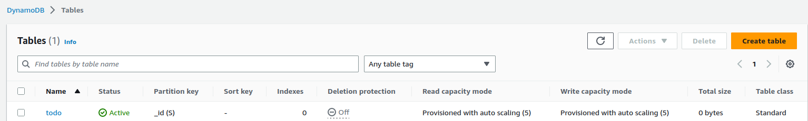

#### Setting up secondary indexes

Secondary indexes need to be set up as properties of the table *todo*. I thought it was appropriate to add them as properties of the table, as these indeces will be queried later when adding items. 

Secondary indexes can be created under: 

```
DynamoDb table --> Indexes --> Create Index
```

The configuration for a secondary index is: 

    - Partition key: label (for example)
    - Data type: string for 'label' and 'title'
    - Rest of the settings stay on default

The index *completed* was causing problems with incompatible data types so it was left out. The current AWS IAM role does not allow the 'LabRole' to access auto scaling information, so this information will not be included in the table. This warning can be ignored. 

Finally, after adding the secondary indexes of *title* and *label*, the secondary indexes of the DynamoDB should look like this:

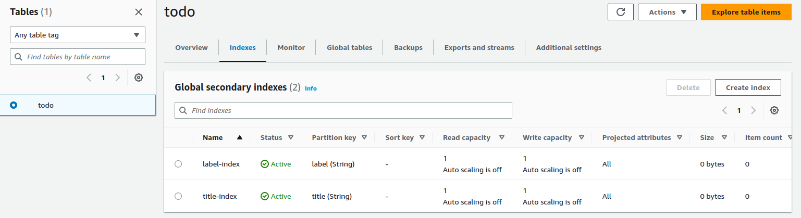

Once the secondary indexes are configured, the Lambdas can be set up.

---
### Step 2: Configure the Lambdas

The lambda functions were given with the backend code for the serverless branch, so they will be added to our Lambda collection in AWS. 

When adding a Lambda function, the configuration for each function is: 

    - Name: <unique lambda name>
    - Runtime: Nodejs
    - Permissions: use 'LabRole'
 
From the documentation we know the following:

- `GET https://apiurl/todo` directs to the lambda function `getTodo`
- `GET https://apiurl/todo/{_id}` directs to the lambda function `getTodo`
- `POST https://apiurl/todo` directs to the lambda function `addTodo`
- `PUT https://apiurl/todo/{_id}` directs to the lambda function `updateTodo`
- `DELETE https://apiurl/todo/{_id}` directs to the lambda function `removeTodo`
- `GET https://apiurl/carrousel` directs to the lambda function `carrousel`

These functions should all be added in AWS, resulting in a ready-to-use collection:

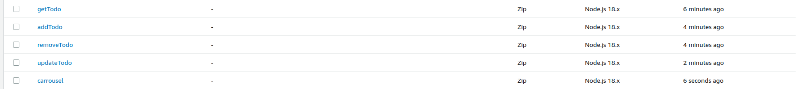

#### Any notable changes to the Lambda functions

No Lambda functions were changed in a major way, but the bucketname carrousel-for-toapp was inserted for the name of the bucket in the *carrousel* function:

```js
    const bucketName = 'carrousel-for-todoapp';
```
The addTodo Lambda is also slightly changed, because GETting the completed boolean was giving a console.log error message, namely: 

```
Cannot read properties of index {0}
```

So in order to help the Lambda set a default value at initialization, I added `'?? false'` to item.completed.

```js
Item: {
        _id: {S: randomUUID()},
        title: {S: item.title},
        label: {S: item.label},
        completed: {BOOL: item.completed ?? false}
}   
```

**Note:** It should be stated that the given *carrousel* function was retrieving all items from the S3 bucket excluding directories, which means that the *carrousel.json* file also gets included. Since the carrousel.json file is used for syncing purposes in the sequelize branch, it is now unfortunately also  included as an image file to try to display as a picture. 

Once the Lambda functions are set up correctly, the API Gateway can be configured. 

---
### Step 3: Configure the API Gateway

The API Gateway needs to be created with the following configurations. The API is a public REST API, since private REST APIs only work inside a VPC. 

**Note:** REST (Representational State Transfer) is a type of architecture used for web services that allows client-server communication over HTTP. A public REST API provides a standardized set of methods, such as GET, POST, PUT, and DELETE, which will be implemented in this use case as the website functionality.

The API Gateway needs to be created with the following configuration:

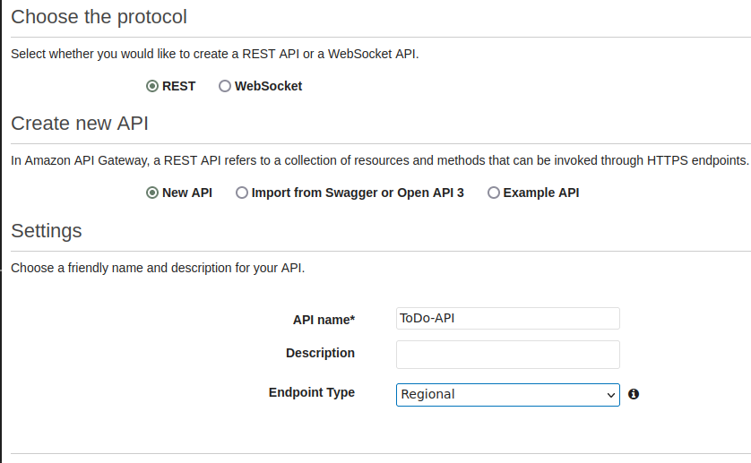

Since the lambda functions are added already, they can be configured as methods in the API.

Methods and Resources are created according to the documentation, with each method linking the correct Lambda function. For example: a GET method is made for the resource */todo*, as seen below. 

**It is however important to check "Use Lambda Proxy integration", otherwise there might be connectivity issues!**

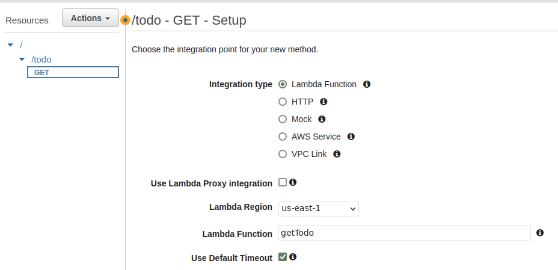

Lambda Proxy integration is a type of integration between AWS API Gateway and AWS Lambda, where the API Gateway passes the entire HTTP request (including HTTP method, headers, query parameters, and body) to the Lambda function as input, and the Lambda function returns an HTTP response to the API Gateway.

The child resource */{id}* is created under */todo*, and eventually our configuration looks like this:

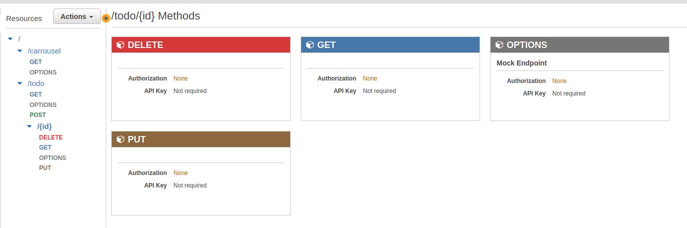

Notice the resources and associated methods on the left, the right section of the screenshot shows what kind of methods are associated with the *{id}* resource: 

The API can now be deployed, under *Actions* --> *Deploy API*, with the configuration: 

    - Deployment Stage: [New Stage]
    - Stage name: initial_deployment
    - Stage Description: Initial configuration for methods set up
    - Deployment description: <blank>

#### Enable CORS

CORS (Cross Origin Resource Sharing) needs to be enabled on resources of an API Gateway in AWS if clients should be able to access API resources from different domains or origins. 

Enabling CORS involves setting response headers on your API Gateway resources that allow or deny cross-origin requests. These headers include "Access-Control-Allow-Origin", "Access-Control-Allow-Methods", "Access-Control-Allow-Headers", "Access-Control-Allow-Credentials", and "Access-Control-Max-Age". This can be done by simply right-clicking on a method or resource, and clicking 'Enable CORS'.


#### Permissions

In order for our frontend to be able to reach our resources we will have to configure some API policies. For the sake of ease, the following API policy can be applied (Everyone is allowed to invoke the API methods).

```
{
    "Version": "2012-10-17",
    "Statement": [
        {
            "Effect": "Allow",
            "Principal": "*",
            "Action": "execute-api:Invoke",
            "Resource": [
                "execute-api:/*/*/*"
            ]
        }
    ]
}
```
Now that an API Gateway is set up, the DynamoDB is ready, two frontend instances can be set up and balanced by a loadbalancer.

---
### Step 4: Setting up the Frontend

The frontend instances can be set up using AutoSaling groups once again, however we cannot reuse the autoscaling groups from the sequelize branch, as the docker compose files are not entirely identical. What needs to be done is to set up an initial frontend host with the existing frontend-AMI that already has docker installed, reconfigure the container with the correct API URL, and the rebuild the compose file. 

After the container is successfully running, a second frontend instance can be built, and both instances can be loadbalanced by a new loadbalancer.

The API Gateway URL is: `https://otyfthehya.execute-api.us-east-1.amazonaws.com`

The deployed API is staged under 'initial_deployment', so the resulting docker compose file like this:

```yml
version: "3.7"
services:
  frontend:
    build:
      context: ./frontend
      args:
        - APIURL=https://otyfthehya.execute-api.us-east-1.amazonaws.com/initial_deployment
    ports:
      - 80:80
    restart: always
```
To avoid problems with the initial VPC, a second VPC is setup.

#### Create a second VPC

A second VPC is created with the following information:
    
    - Name: MyApp2-VPC
    - IPv4 CIDR block: 10.0.0.0/16
    - No IPv6 CIDR block
    - Tenancy: Default
    - Number of Availability Zones: 2 (us-east-1e, us-east-1f)
    - Number of public subnets: 2 (for loadbalancing purposes)
    - Number of private subnets: 2
    - NAT gateways: None
    - VPC endpoints: S3 Gateway

When using the *VPC and more* VPC wizard the subnets automatically create an internet gateway and a network connection for the newly made subnets.


A frontend instance is created in the new subnet:

    - Name: frontend-serverless-backend
    - VPC: MyApp2-VPC
    - Type: t2.micro
    - AMI: frontend-image
    - Keypair: vockey
    - Enable autoassign public IP
    - Security Group: Create a new SG 'frontend-serverless' that allows SSH and HTTP from anywhere
    - Subnet: subnet-public1-us-east-1e

For the sake of ease, an identical frontend instance is set up, with a target group listening on HTTP /, and a load balancer using that target group. That way, there is no dependence on session IP's that change every 4 hours. 

The new setup with a serverless backend should now be available under the Public DNS name of the Load Balancer. 

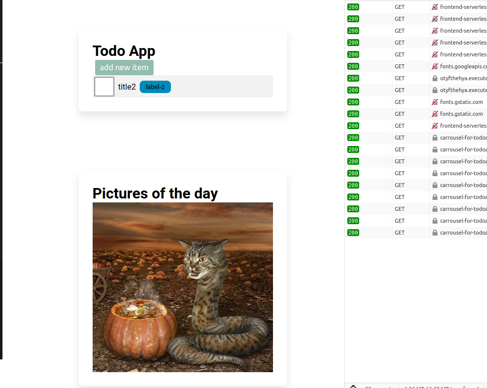

After having completed the serverless backend setup, the next step is trying to achieve a fully serverless setup.

---
## Completely Serverless

#### System diagram:

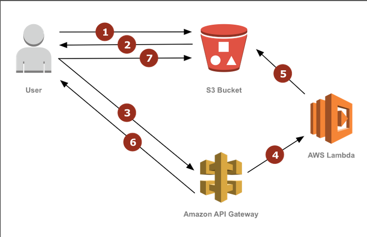

Based on this diagram some key information kan be understood: 

- 1 S3 Bucket for the Static Assets (images)
- The S3 will host a static website (User requests to and from the S3)
- The API Gateway will handle the requests from the user
- Lambda functions will extend the functionality of the API Gateway

---
### Step 1: Create a second S3 Bucket

A second bucket can be created with a unique name, in this case the name is `serverless-bucket-fortodo`. 

Static website hosting can be found in the *Properties* tab of the Bucket, under 

```
Properties --> Static website hosting --> Edit --> Enable --> Host a static website --> Index document: index.html
```

The index.html document is found under *./frontend/src/index.html* for our frontend, but the frontend still needs to be built and uploaded to the bucket, so that path will change. First, the permissions of the bucket can be set to public read.


#### Permissions

The website should be accessible to a user, and to the internet, so public access needs to be granted to the objects of the S3 bucket. "Block all public access" can therefore be unchecked. 

Additionally, the objects inside the S3 bucket need to have public read permissions as well, so that the website can be viewed. A public read policy can be configured for that:

```
{
	"Version": "2012-10-17",
	"Statement": [
		{
			"Sid": "PublicRead",
			"Effect": "Allow",
			"Principal": "*",
			"Action": [
				"s3:GetObject",
				"s3:GetObjectVersion"
			],
			"Resource": "arn:aws:s3:::serverless-bucket-fortodo/*"
		}
	]
}
```

This allows public read access towards the contents of the S3 bucket. 

#### Building The Application

An important environment variable in the frontend needs to be changed first, namely the APIURL variable in the `frontend/src/environments/environment.prod.ts` file (& `environment.ts file`), the APIURL needs to be changed to the URL of our API Gateway:

```js
export const environment = {
  production: true,
  apiurl: 'https://otyfthehya.execute-api.us-east-1.amazonaws.com/initial_deployment',
};
```

After changing the environment variable, some depenencies need to be installed. The application can then finally be built with `ng build`.

```
sudo apt install npm
sudo npm install -g @angular/cli
npm install

ng build
``` 
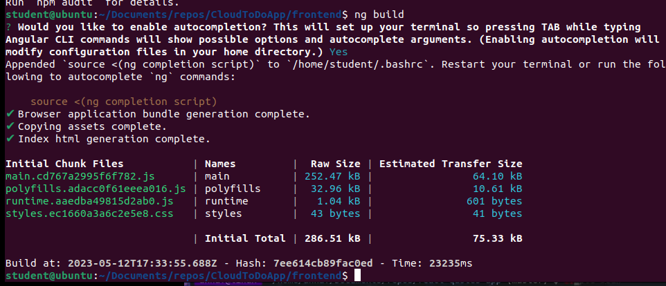

Once the build is complete, it can be checked to see if it's working under `localhost:4200`, if `ng serve` was run before/after building. The build artifacts will be stored in the `dist/` directory, and the `dist/frontend/` directory contents will be synced to the S3 bucket

#### Hosting the app on the s3 bucket

Once in the `CloudToDoApp/frontend/dist` directory, the contents of the directory can be synced with the S3 bucket with the command: 

```
aws s3 sync dist/ s3://serverless-bucket-fortodo/
```

The contents of the build should be available in the bucket now:

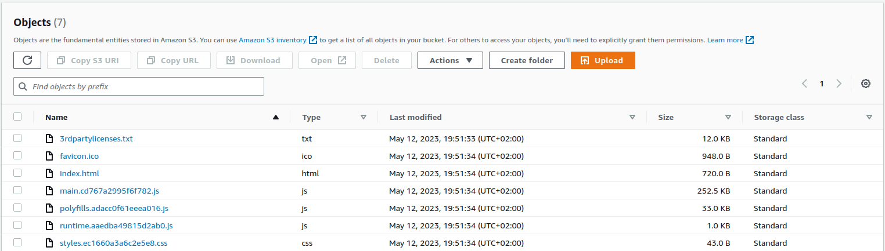

Now when navigating to the Properties tab --> Static website hosting, the link for the statically hosted website is visible there:

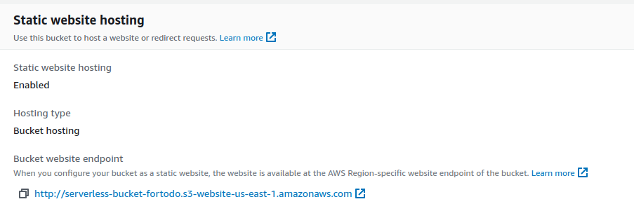


And finally, when accessing the website link, the TODO App appears.


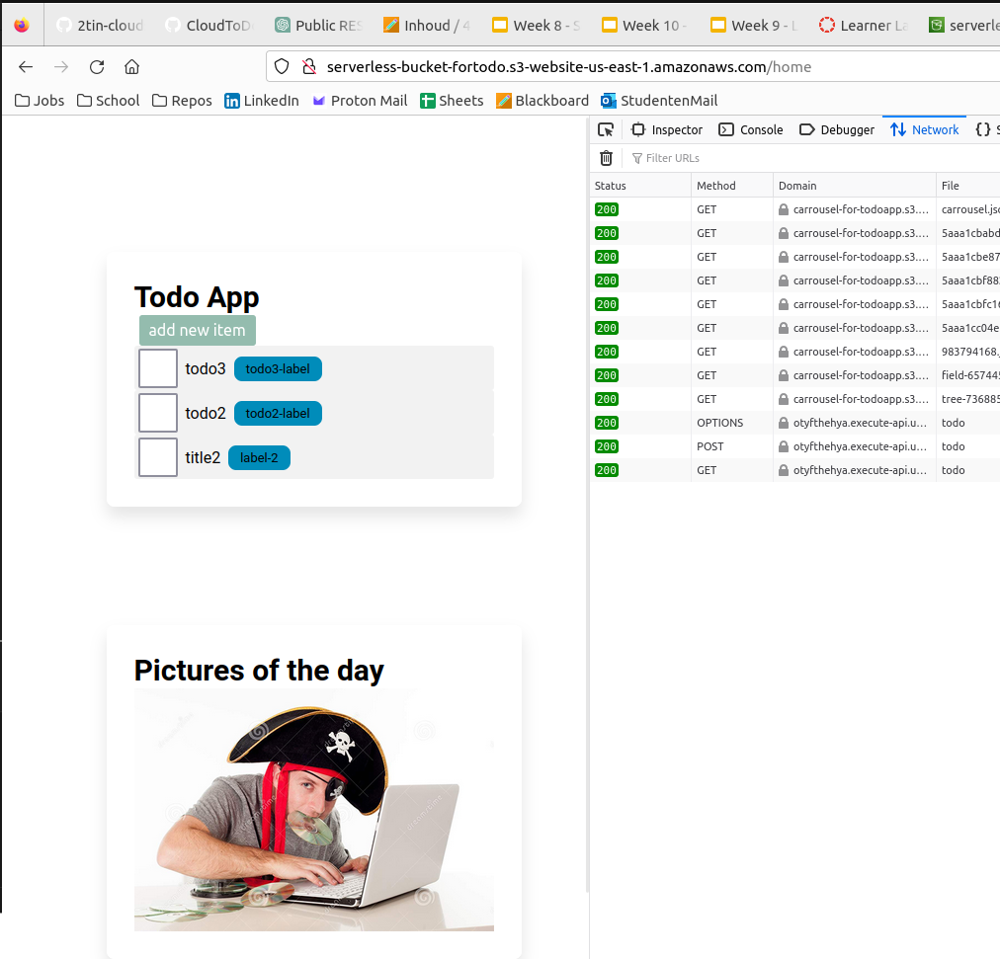

In order to Monitor how the key resources of the AWS setup are perorming, CloudWatch can be used to set up a basic dashboard.

---
### Monitoring

Now that the sequelize and serverless setups are working, key metrics can be compiled in a dashboard using CloudWatch. The resources that will bemonitored by CloudWatch are:

    - Loadbalancer metrics
    - API-Gateway metrics
    - DB metrics
    - Autoscaling health metrics 

A dashboard can be created at

``` 
CloudWatch --> Create a New Dashboard --> Empty Explorer Dashboard
```

Before setting up a dashbord, the required resources need to have Name Tags, otherwise they can't be found in Cloud Watch. 

After adding appropriate name tags on the key resources of interest, a dashboard can be compiled. 

The metrics that are compiled in the dashboard below consist of:

API Gateway: 

    - API Gateway 4XX Error: Sum
    - API Gateway 5XX Error: Sum
    - All API Resources: Integration Latency
    - All Resources: Latency

ELB's:

    - Active Connection Count: Sum
    - ConsumedLCU's*: Average
    - All 4XX Count: Sum
    - All resources request Count:Sum

DynamoDB

    - Conditional Check Failed Requests: Sum
    - Transaction Conflict: Average

Autoscaling: 

    - CPUUtilization: Average
    - NetworkIn: Average
    - NetworkOut: Average
    - Status Check Failed Instance


*LCU: In the context of AWS API Gateway, LCU stands for "Lambda Compute Unit". It is a unit of measure representing the amount of compute resources used by a Lambda function for a single execution, with one LCU corresponding to the amount of compute resources available in a 1.0 GHz, 1 vCPU Amazon EC2 instance for one hour


Finally, a dashboard consisting of four key explorer groups can be seen:

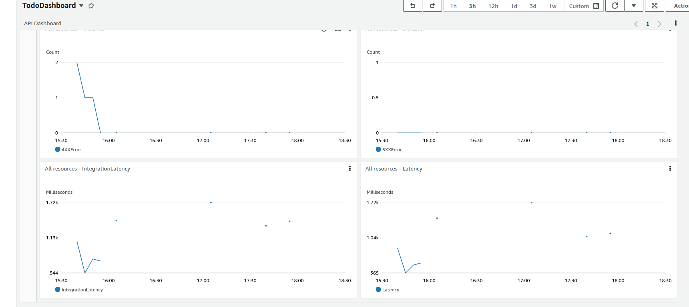

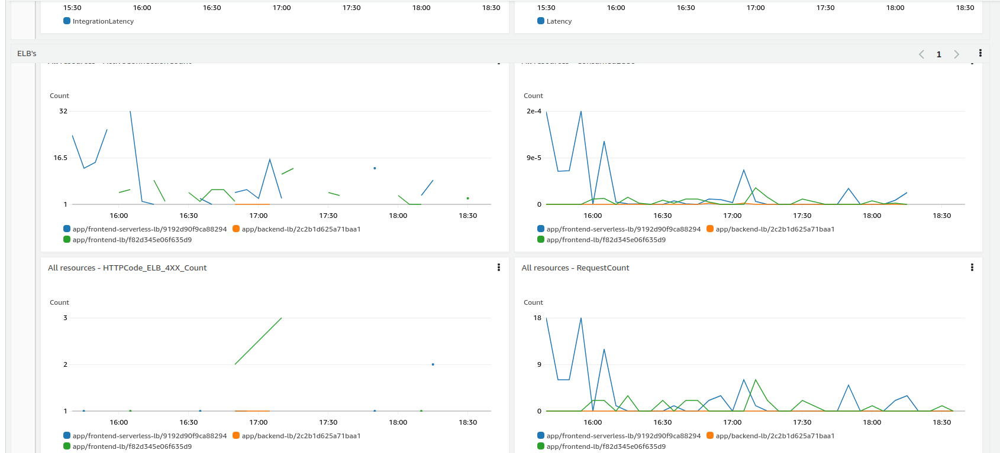

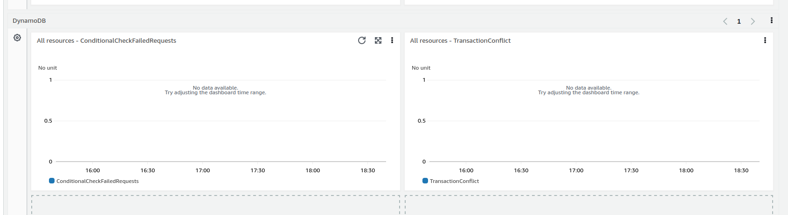

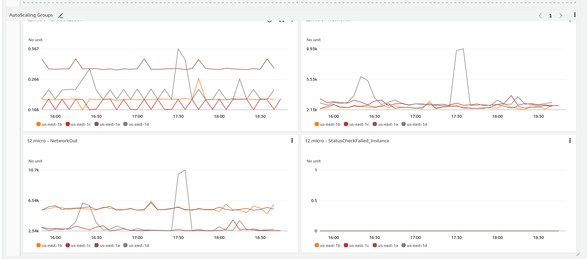


---
### [Back: Sequelize](sequelize_documentation.md#contents)

### [Back to top](#contents)