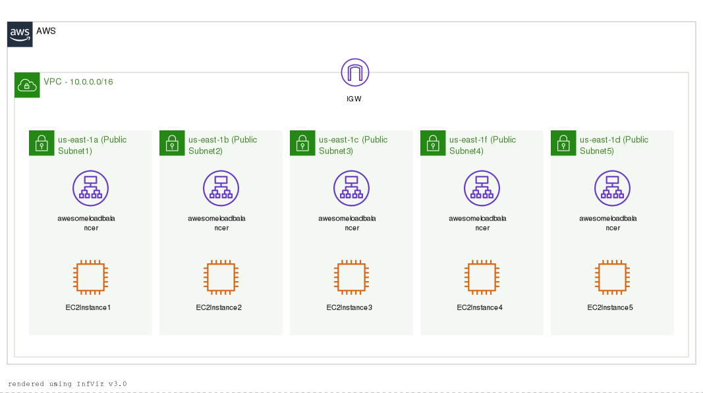

# PE Opdracht 1 2022-2023

## Overzicht
Deze PE bestaat uit 2 delen en zal in de klas afgenomen worden over de periode van de volledige 2 lesuren.

**Deel 1** bestaat uit het opzetten van een _nieuwe_ AWS omgeving **met behulp van de AWS CLI**.

**Deel 2** bestaat uit het troubleshooten en herstellen van een _bestaande_ AWS omgeving.
Om dit deel vlot te laten verlopen kan je best de `setup` van dit deel starten alvorens aan opgave 1 te beginnen.

## Deel 1 - 25 punten
Onderstaande structuur zet je op aan de hand van de AWS CLI. Voor elke opgave voorzie je enerzijds het gebruikte commando als ook een screenshot van de output van het commando in de file `oplossing.md`. Deze screenshot is _embedded_ in het oplossingsbestand!

_Hint: ``_

Een voorbeeld van de gevraagde output is te vinden onder _Antwoord A_ in de file `oplossing.md`.

### **VPC (B) - 4 punten**
Maak een nieuwe VPC aan met 2 publieke subnets, elk in een andere availability zone. Zorg ervoor dat deze VPC een tag krijgt met als key `Name` en als value `vpc-pe`.

Documenteer je commando(s) en screenshot in `oplossing.md` onder de titel `Antwoord B`.

### **VPC internet connectie (C) - 5 punten**
Zorg ervoor dat de VPC voorzien is van een internetverbinding a.d.h.v. een internet gateway (naam `vpc-pe-igw`) & route-table (naam `vpc-pe-rtb`).

Documenteer je commando(s) en screenshot in `oplossing.md` onder de titel `Antwoord C`.

### **AMI (D) - 2 punten**
Voorzie een oplijsting van alle AMI's waarvan amazon eigenaar is. Toon in de output enkel de `ImageId` en `Name` velden.

Documenteer je commando(s) en screenshot in `oplossing.md` onder de titel `Antwoord D`.

### **Key pair (E) - 2 punten**
Maak een nieuwe key pair met de naam `kp-pe`  en zorg ervoor dat de key meteen opgeslagen wordt in de file `pecloud.pem`.

Documenteer je commando(s) en screenshot in `oplossing.md` onder de titel `Antwoord E`.

### **EC2 instance (F) - 6 punten** 
Maak 2 nieuwe EC2 instances (beide in een ander subnet) met al snaam `ec2-pe-1` en `ec2-pe-2` gebruik makend van een versie van cloud9 AMI (deze AMI kan je halen uit de vorige opdracht). De instance type is `t2.micro` en je koppelt ook de key `kp-pe` aan deze machines. 

Zorg er bijkomend voor dat de machines bereikbaar zijn via poort 80 en poort 22.

Documenteer je commando(s) en screenshot in `oplossing.md` onder de titel `Antwoord F`.

### **Loadbalancer (G) - 6 punten**
Zet een _application_ loadbalancer met als naam "lb-pe" op die het verkeer stuurt naar de 2 machines uit de vorige opgave. Voorzie de nodige infrastructuur.

Documenteer je commando(s) en screenshot in `oplossing.md` onder de titel `Antwoord G`.

### **Overzicht (H) - 0 punten**
Voer volgende commando's uit & voorzie screenshots van de output:
```
 aws ec2 describe-subnets --filters "Name=vpc-id,Values=$(aws ec2 describe-vpcs --filters "Name=tag:Name,Values=*pe*" --query 'Vpcs[*].VpcId' --output text)" --query 'Subnets[*].[SubnetId,CidrBlock,AvailabilityZone,Tags[?Key==`Name`].Value]'
```

```
aws ec2 describe-route-tables --filters "Name=vpc-id,Values=$(aws ec2 describe-vpcs --filters "Name=tag:Name,Values=*pe*" --query 'Vpcs[*].VpcId' --output text)" --query "RouteTables[*].[Associations[*].SubnetId, Routes[*].[DestinationCidrBlock,GatewayId]]"
```

```
aws ec2 describe-instances --filters "Name=tag:Name,Values=*pe*" --query 'Reservations[*].Instances[*].[InstanceId,InstanceType,KeyName,Placement.AvailabilityZone,PrivateIpAddress,SecurityGroups[].GroupId,SubnetId,Tags[?Key==`Name`].Value]'
```

```
aws elbv2 describe-load-balancers --names lb-pe
```


## Deel 2 - 10 punten

### **Setup**
Start dit deel door de infrastructuur die je moet gaan troubleshooten op te zetten.
Dit doe je door in je AWS CLI het volgende commando uit te voeren (nadat je de `deel2.yml` file gedownload hebt)

```
aws cloudformation deploy --template-file deel2.yml --stack-name CalculatorApp
```
Na succesvolle uitvoering heb je een cloud deploy van onze DevOps Calculator!
> Het kan echter tot **5 minuten** na de succesvolle deploy duren alvorens alle instances geregistreerd  > zijn op de loadbalancer, wees dus geduldig!

### **Opgave**

De DevOps Calculator heeft namelijk veel success en om deze groei te ondersteunen en de beste gebruikerservaring te kunnen blijven bieden, gaan we onze applicatie migreren naar een high-available cloud infrastructuur.

Hieronder een overzichtsdiagram van de voorgestelde infrastructuur:



De applicatie wordt op 5 EC2's opgezet, deze zitten alle 5 in een targetgroup die gekoppeld is aan de loadbalancer zodat het verkeer over de 5 instanties verdeeld wordt.


We merken nu echter dat er een aantal problemen zijn (3):

3 EC2 instances worden om een of andere reden niet gebruikt door de loadbalancer. 


Om dit makkelijker te troubleshooten hebben we elke instance van een andere achtergrondkleur voorzien:
 - Instance 1: Blauw
 - Instance 2: Rood
 - Instance 3: Geel
 - Instance 4: Groen
 - Instance 5: Paars

Onderzoek de verschillende problemen, repareer wat er fout is en post een screenshot met korte uitleg in `oplossing.md` onder de titel `Antwoorden Deel 2`.


> **Tip!  
> Voor dit deel van de PE mag je de AWS Console wel gebruiken!**


### Afsluiten van de oefening

Om alles terug correct te verwijderen en ervoor te zorgen dat je geen onnodige kosten krijgt op je account doe je op het einde van de PE hetvolgende commando om alles terug te verwijderen:

```
aws cloudformation delete-stack --stack-name CalculatorApp
```