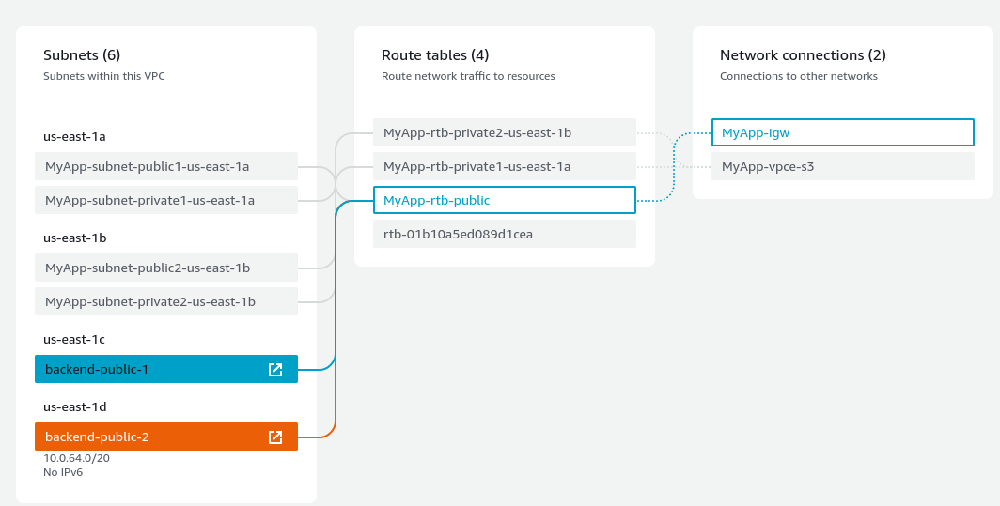
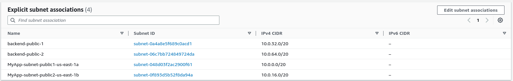
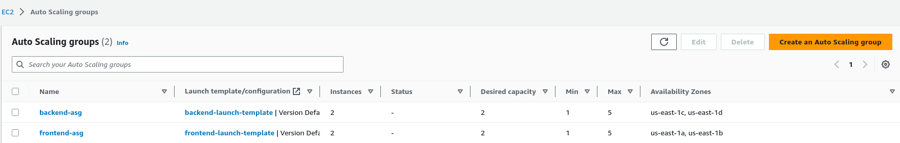
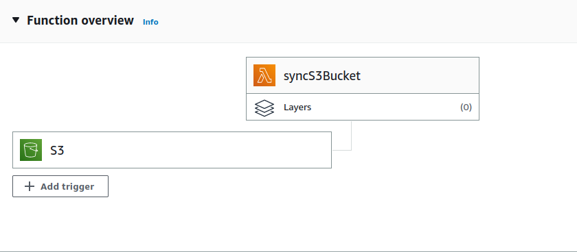
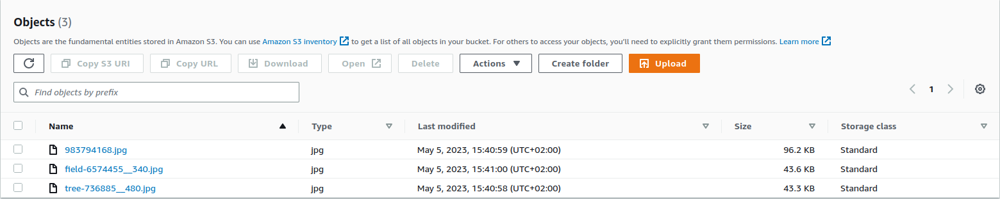
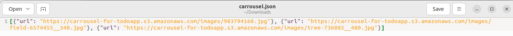
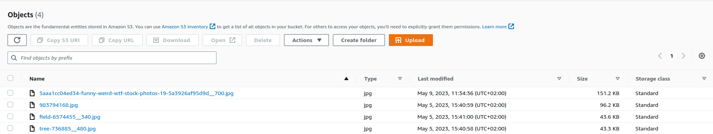
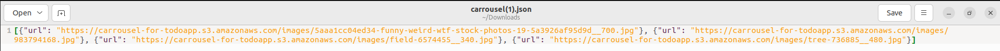
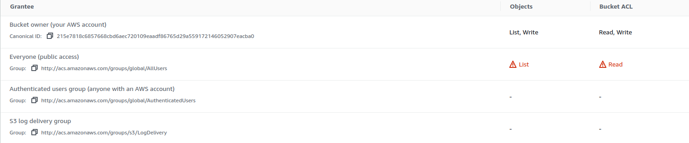

#### [Go to: Serverless](serverless_documentation.md#contents)

#  Sequelize Documentation

## Contents
1. Create MyApp-VPC
2. Create the security groups and first frontend instance
3. Create an AMI, frontend TG and LB for frontend
4. Setting up the Backend
5. Create an RDS
6. Setup backend TG and LB with backend instances
7. Link Backend to Frontend
8. Launch Template and Autoscaling Group
9. Create syncing S3 bucket

---

#### Architecture diagram:


Based on this diagram some key information kan be understood: 

- 1 S3 Bucket for the Static Assets (images)
- 2x EC2 T2.micro instances for the frontend
- 2x EC2 T2.micro instances for the backend
- 5 security groups managing access
- 2 Load Balancers, one each for backend/frontend
- **or** 1 Load Balancer for frontend & 1 API Gateway for the backend
- Auto Scaling groups for both the front and backend

**Note:**: There are two ways to approach the backend instances: Either an internet-facing load balancer is connected to two backend instances that exist in public subnets, or an API Gateway is connected to an internal load balancer, connected to the two backend instances existing in private subnets. We will move forward with the internet-facing load balancer and without the API Gateway for the sequelize branch. 

---
### Step 1: Creating the VPC

A VPC is created with the following information:
    
    - Name: MyApp-VPC
    - IPv4 CIDR block: 10.0.0.0/16
    - No IPv6 CIDR block
    - Tenancy: Default
    - Number of Availability Zones: 4 (us-east-1a, us-east-1b, us-east-1c, us-east-1d)
    - Number of public subnets: 4
    - Number of private subnets: 2
    - NAT gateways: None
    - VPC endpoints: S3 Gateway

**Note:** Additional subnets can be created with the CLI if the Console doesn't allow the creation of a subnet with more than 3 public subnets:
```console
aws ec2 create-subnet --vpc-id vpc-0768c33ea9bb40be6 --cidr-block 10.0.32.0/16 --availability-zone us-east-1c

aws ec2 create-subnet --vpc-id vpc-0768c33ea9bb40be6 --cidr-block 10.0.64.0/16 --availability-zone us-east-1d

```

When creating separate subnets, it's important that the routing tables are set up correctly. The routing table that has a public connection needs to have all involved subnets associated with it:



#### Subnet associations for MyApp-rtb-public



---
### Step 2: Creating the Security Groups

Security Groups can be set up to only allow other necessary security groups:

*All security groups have VPC: MyApp-VPC*

    - MyFront-End-Load-Balancer --> Inbound: allow HTTP 80 for all
    - MyFront-End               --> Inbound: allow HTTP 80 for MyFront-End-Load-Balancer
    - MyBack-End-API/LB         --> Inbound: allow TCP 8090 for all
    - MyBack-End                --> Inbound: allow TCP 8090 from MyBack-End-API/LoadBalancer 
    - My-DB                     --> Inbound: allow TCP 3306 from MyBack-End


SSH on port 22 can be temporarily set open for anyone in security groups *MyFront-End* and *MyBack-End* to configure the frontend and backend instances. 

For starters one EC2 instance will be created, since the second EC2 instance will be based on the AMI from the first one. The first EC2 instance contains the following information:

    - Name: frontend-1
    - VPC: MyApp-VPC
    - Type: t2.micro
    - AMI: default Ubuntu 22.04
    - Keypair: vockey
    - Security Group: MyFront-End
    - Subnet: subnet-public1-us-east-1a


The container hosting the front-end, including the directory 'frontend' that contains all necessary files needs to be copied to the EC2 instance. 

```console
scp -i ~/Downloads/labsuser.pem -r frontend ubuntu@<IPv4-DNS-frontend1>:~/
scp -i ~/Downloads/labsuser.pem docker-compose.yml ubuntu@<IPv4-DNS-frontend1>:~/
```

Docker will need to be installed:

```console
curl -fsSL https://get.docker.com -o get-docker.sh
sh get-docker.sh
sudo usermod -aG docker $USER
```

The docker compose file in frontend looks like this:
```yml
version: "3.7"
services:
  frontend:
    build:
      context: ./frontend
      args:
        - APIURL=http://<MyBack-End-LB>:8090
    ports:
      - 80:80
    restart: always

```
For now APIURL=localhost:8090 can be used, the APIURL will be substituted later. *restart: always* is good for ensuring availability against temporary downtime. The compose is built and run:
```console
docker compose build
docker compose up -d
```
---
### Step 3: Create a Target Group and Load Balancer

First a second frontend EC2 instance is created based on the frontend AMI. The difference with this EC2 instance is that it is hosted in a different subnet and availability zone.

    - Name: frontend-2
    - VPC: MyApp-VPC
    - Security Group: MyFront-End
    - AMI: frontend-AMI
    - Keypair: vockey
    - Subnet: subnet-public1-us-east-1b (other subnet!)

A Target Group is created with the two existing frontend instances. 

    - Target type: instances
    - TG name: frontend-tg
    - Protocol: Http on port 80
    - VPC: MyApp-VPC
    - Protocol version: HTTP1
    - Health checks: default settings
    - Include: frontend-1, frontend-2

Now a new Load Balancer can be created

    - Name: frontend-lb
    - Scheme: internet-facing
    - Ip address type: IPv4
    - VPC: MyApp-VPC
    - Target Group: frontend-tg
    - Mappings: (both public) us-east-1a, us-east-1b 
    - Security groups: MyFront-End-Load-Balancer
    - Listeners and routing: listen port 80 traffic and forward to frontend-tg target group

**Note**: Check the health of the target group instances to see whether the target group and load balancer are healthy and functioning properly. Creating an AMI can kill running containers and could cause unhealthy instances if the target health requests are not met, so those containers might need to be restarted if the *restart: always* flag was not added in the compose file. 

---
### Step 4: Setting up The Backend

A new backend EC2 instance is created:
    
    - Name: backend-1
    - VPC: MyApp-VPC
    - Security Group: MyBack-End-sg
    - AMI: Ubuntu latest
    - Keypair: vockey
    - Subnet: backend-public-1 (us-east-1c)

After the instance is set up, the same installation procedure is done for docker, and the directory 'backend/' is copied over to the instance with scp. The following backend container is started on the instance:

```yml
version: "3.7"
services:
  backend:
    build:
      context: ./backend
    ports:
      - 8090:8080
    environment:
      - PORT=8080
      - DBURL=mysql
      - DBUSER=root
      - DBPASSWORD=password
      - DBDATABASE=todo
      - DBPORT=3306
    restart: always
```
**Note:** The DBURL will be replaced with the URL of an RDS that is created in the next step. 

After the backend files are placed on the instance, and the instance can execute docker commands, a second EC2 instance is launched with an AMI based on backend-1. This instance is placed in **backend-public-2** (us-east-1d). 

Now two frontend instances exist in *us-east-1a, us-east-1b*, and two backend instances exist in *us-east-1c, us-east-1d*. The load balancers will ensure fault tolerance and high availability, and the load balancer for the backend will be created after the RDS.

---
### Step 5: Create an RDS

Currently the compose file from the backend instance specifies **DBURL=mysql**, referencing another container. We need to set up an RDS DB for the backend instance to connect to:

#### RDS specifications:

    - Engine Options: MySQL (Community Edition)
    - DB instance-identifier: database-1
    - Master username: root
    - password: 'password'
    - DB instance class: Burstable classes
    - Allocated Storage : 20GB
    - Enable storage autoscaling
    - VPC: MyApp-VPC
    - Security Group: MyDB-sg
    - Initial Database name: todo
    - Subnets: us-east-1c, us-east-1d (backend-1 & backend-2 zones)
 

 Once created, the endpoint of the database needs to be used as the DBURL specified in the backend compose file, in our case the RDS endpoint is: 
```
database-1.cdptwqaxrhvz.us-east-1.rds.amazonaws.com
```

The backend container needs to be edited to use the correct DBURL, rebuilt, and recomposed. 

```yml
version: "3.7"
services:
  backend:
    build:
      context: ./backend
    ports:
      - 8090:8080
    environment:
      - PORT=8080
      - DBURL=database-1.cdptwqaxrhvz.us-east-1.rds.amazonaws.com
      - DBUSER=root
      - DBPASSWORD=password
      - DBDATABASE=todo
      - DBPORT=3306
    restart: always
```
---
### Step 6: Create another TG and LB for the backend

A new Target Group and Load Balancer is created for the backend, so that a Load Balancer can ensure fault tolerance. The settings can be similar to frontend-tg, with the only difference being:

#### Target group specs:

    - TG name: backend-tg
    - Protocol: Http on port 8090
    - Listen to: /health

#### Load balancer specs:

    - name: backend-lb
    - Scheme: internet-facing
    - Ip address type: IPv4
    - VPC: MyApp-VPC
    - Mappings: us-east-1c, us-east-1d 
    - Security groups: MyBack-End-API-sg
    - Listeners and routing: listen port 8090 traffic and forward to backend-tg target group

---
### Step 7: Link Backend to Frontend

Now that two Load Balancers are in place, all instances are running, and the MySQL RDS is up and running, the front-end instances can be rebuilt with the URL of the Backend Load Balancer. The docker compose file for the front-end becomes this:

```yml
version: "3.7"
services:
  frontend:
    build:
      context: ./frontend
      args:
        - APIURL=http://backend-lb-1149720257.us-east-1.elb.amazonaws.com:8090
    ports:
      - 80:80
    restart: always

```

**Note**: Since an environment variable (APIURL) is being modified, run *docker compose build* to rebuild the solution before running the compose file again.

Check whether the frontend-tg and backend-tg are still healthy by refreshing the instances inside the TG after a few minutes have passed. 

---
### Step 8: Launch Templates and Autoscaling Groups

To make sure that unexpected load can be handled properly in the frontend, it's appropriate to set up an Auto Scaling group. An Auto Scaling group contains a collection of EC2 instances that are treated as a logical grouping for the purposes of automatic scaling. 

An Auto Scaling group needs a launch template to be able to quickly launch identical instances on demand, so this needs to be made first. After creating a second frontend AMI that contains the latest compose configurations (*frontend-sequelize-finished*), a launch template is created:

    - Name: frontend-launch-template
    - Auto Scaling guidance: checked
    - AMI: frontend-sequelize-finished
    - Instance type: t2.micro
    - Key pair: vockey
    - Subnet: Don't include in launch template
    - Security group: MyFront-End-sg

After the launch template is defined, the Auto Scaling group can be set up:

    - Name: frontend-asg
    - Launch template: frontend-launch-template
    - VPC: MyApp-VPC
    - Availability zones & subnets: us-east-1a, us-east-1b (frontend zones/subnets)
    - Attach to an existing load balancer target group (frontend-tg | HTTP)
    - Desired capacity: 2
    - Minimum capacity: 1
    - Maximum capacity: 5
    - Scaling policies: None

To maximize high availability, the same will be done to the backend instances. The **backend public subnets** will be selected for the ASG, as will the **MyBack-End-sg**.  

**Note:** It's important that the new backend instances from the autoscaling grous automatically have IP adresses allocated to them, otherwise the frontend will have difficulty retrieving the images for the carrousel. 

Finally, two autoscaling groups will be ready to scaled unexpected loads appropriately:



The original instances can be turned off or terminated after creating the autoscaling groups. For now, since the S3 bucket isn't fully set up yet it, the instances should be kept on, because the backend files route files need to be modified. Finally, the S3 bucket with static assets will be instantiated in the next step.

---
### Step 9: Create syncing S3 Bucket

First, an S3 bucket is needed to store the static assets. With AWS S3 services the following bucket is created:

Bucket Specs:

    - Bucket name: carrousel-for-todoapp
    - AWS Region: us-east-1
    - ACLs enabled: Bucket owner can Read & Write, Everyone can Read
    - Block public access: Off
    - Bucket Versioning: Off
    - Default Encryption

In the S3 bucket, two directories need to be placed: **images/** and **carrousel/**. The images directory contains images, the carrousel directory contains the *carrousel.json* file from the backend/data/ directory on the backend instances. 

In order to automatically update the URLs inside the *carrousel.json* file a lambda function is used to enumerate the images/ directory and place all URLs in the carrousel.json file. The lambda function is as follows:

Lambda function

    - Lambda name: syncS3Bucket
    - Runtime: Python
    - Architecture: x86_64
    - Use an existing role: LabRole
    - Even trigger: If changes are made to images/ dir in S3 bucket

The code for the Lambda function is: 
```python
import boto3
import json

ec2 = boto3.resource('ec2')
s3_client = boto3.client('s3')

def lambda_handler(event, context):
    bucket_name = 'carrousel-for-todoapp'
    images_folder = 'images/'
    carrousel_folder = 'carrousel/'
    carrousel_file = 'carrousel.json'

    # Get the contents of the images folder
    images_objects = s3_client.list_objects_v2(Bucket=bucket_name, Prefix=images_folder)
    image_keys = [obj['Key'] for obj in images_objects['Contents'] if obj['Key'] != images_folder]

    # Create a list of objects for the carrousel contents
    carrousel_contents = [{"url": f"https://{bucket_name}.s3.amazonaws.com/{image_key}"} for image_key in image_keys]

    # Write the updated carrousel.json file back to S3
    s3_client.put_object(Bucket=bucket_name, Key=carrousel_folder + carrousel_file, Body=json.dumps(carrousel_contents))
```
The python file imports the necessary dependencies and declares the necessary variables. A list is made of all objects inside the images/ folder, and stored in *images_objects*. The filenames are stored in the *image_keys* variable. The function is written to enumerate so that deleting images will delete URLs from the json file as well. 

A simple for loop appends the URLs with the necessary json format to the *carrousel_contents* variable, and dumps the contents in the carrousel.json file, effectively overwriting it. 

#### Linking the S3 Bucket with the Lambda function

An Event trigger is added, this can be done either through the Lambda function configuration or the S3 bucket. In the S3 bucket the event trigger can be configured in the Properties Tab:

```
Properties Tab --> Event notifications --> Create event notification --> Event type: All object create events, all object removal events --> Destination type: syncS3Bucket Lambda function.
```

The lambda function will have an S3 trigger added in the overview:




After deployment, the function can be tested when writing/deleting an (new) object to/from the images/ folder, and seeing whether the new image URL will be included in the carrousel.json file:

**Example**: S3 bucket and json file before adding a new image




Notice there are three URLs in the *carrousel.json* file. Now after adding a new image to the images/ directory, there are four URLs in the json file:





#### Syncing the S3 carrousel file with the backend EC2 instances

Instead of actually syncing the backend/data/carrousel.json file with the carrousel.json file in the S3 bucket, the 'sync' has been replaced with a fetch block instead. Right now the Lambda function makes sure to include the URLs in the carrousel.json file. In the backend, a file called *./backend/routes/carrousel.json.js* handles the request to route to the *carrousel.json* file in the backend. 

The route for the *carrousel.json* file can be 'rerouted' to do a fetch from the S3 bucket instead. Note that *npm install node-fetch* needs to be run on the instances beofre the module can be imported in the fetch block, otheriwse it will fail. 

```js
const express = require('express');
const carrouselRouter = express.Router();

carrouselRouter.get('', async (req, res) => {
  try {
    const fetch = await import('node-fetch');
    const response = await fetch.default('https://carrousel-for-todoapp.s3.amazonaws.com/carrousel/carrousel.json');
    const carrouselData = await response.json();
    res.json(carrouselData);
  } catch (err) {
    console.log(err);
    res.status(500).send('Error fetching data from S3');
  }
});

module.exports = carrouselRouter;
```

Now, when refreshing the frontend, the backend data will be executing a fetch everytime it is reloaded, resulting in a 'sync' between the S3 bucket and the backend instances. 

**Note:** Make sure to reconfigure the backend-asg Auto Scaling Group to use the new backend configuration, otherwise it will not work properly. 

#### S3 Bucket Permissions

The fetch will only work if the S3 bucket permissions are set correctly. A Bucket policy can be configured to grant public read access to 'Everyone' for specific resources: 

```
{
    "Version": "2012-10-17",
    "Statement": [
        {
            "Sid": "PublicReadAccessEveryone",
            "Effect": "Allow",
            "Principal": "*",
            "Action": "s3:GetObject",
            "Resource": [
                "arn:aws:s3:::carrousel-for-todoapp/images",
                "arn:aws:s3:::carrousel-for-todoapp/images/*",
                "arn:aws:s3:::carrousel-for-todoapp/carrousel/carrousel.json"
            ]
        }
    ]
}
```
The contents of the images folder, as well as the carrousel.json file are now readable by everyone. For good measure the Access Control List can be modified for everyone to have list and read access as well.



Now, when refreshing the application in the frontend, the frontend is able to gather the images via the backend making a fetch to the S3 bucket. 

### [Next: Serverless](serverless_documentation.md#contents)

### [Back to top](#contents)

