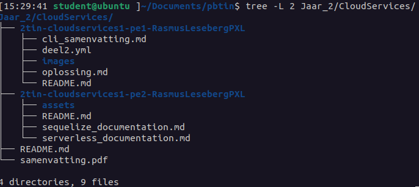

# Cloud Services I

### Year: 2022-2023

This directory contains exercises and summaries for the Cloud Services I subject from PBTIN SNB 2022-23. The contents are split over different directories: 

    * 2tin-cloudservices1-pe1
    * 2tin-cloudservices1-pe2
    * samenvatting.pdf

`2tin-cloudservices-pe1` contains the solution to PE1, but also a summary of the most useful commands for that assignment. The summary was made by **[Tristan Reynders](https://github.com/tristan-reynders)**, all credit goes to him regarding that work. He also co-wrote the summary *samenvatting.pdf* for the course. 

`2tin-cloudservices-pe2` 

**PE1 Score:** 18/30

**PE2 Score:** 64/70

#### Directory contents:

