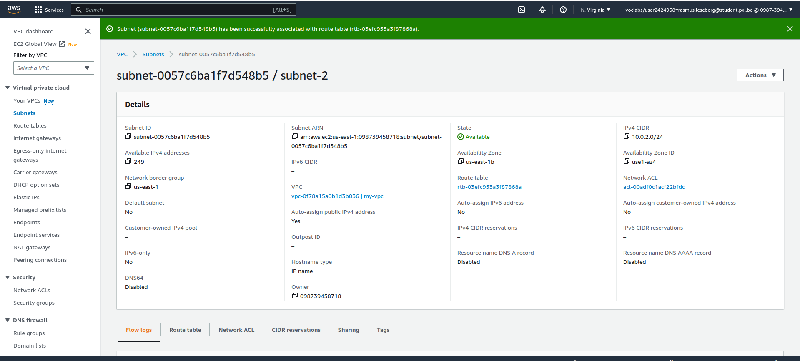

# Deel 1
## Antwoord A
Gebruikte commando(s):
```
$ aws dit is een voorbeeld antwoord
```
```
$ aws dit is commando 2 in het voorbeeld antwoord
```
Screenshot:


## Antwoord B
Gebruikte commando(s):
```
aws ec2 create-vpc --cidr-block 10.0.0.0/16 --instance-tenancy default --tag-specifications 'ResourceType=vpc,Tags=[{Key=Name,Value=vpc-pe}]' 
```

VPCid = vpc-0cf411036fb1e8146

```
aws ec2 create-subnet --vpc-id vpc-0cf411036fb1e8146 --cidr-block 10.0.1.0/24 --availability-zone us-east-1a --tag-specifications 'ResourceType=subnet,Tags=[{Key=Name,Value=public-subnet-a}]'
```
```
aws ec2 create-subnet --vpc-id vpc-0cf411036fb1e8146 --cidr-block 10.0.2.0/24 --availability-zone us-east-1b --tag-specifications 'ResourceType=subnet,Tags=[{Key=Name,Value=public-subnet-b}]'
```

Screenshot:


## Antwoord C
Gebruikte commando(s):
```
aws ec2 create-internet-gateway
```
Internet GWid: igw-01fb8c983818f23bc
```
aws ec2 attach-internet-gateway --internet-gateway-id igw-01fb8c983818f23bc --vpc-id vpc-0cf411036fb1e8146 
```
```
aws ec2 create-route-table --vpc-id vpc-0cf411036fb1e8146 --tag-specifications 'ResourceType=route-table,Tags=[{Key=Name,Value=vpc-pe-rtb}]'
```

Screenshot:


## Antwoord D
Gebruikte commando(s):
```
aws ec2 describe-images --owners amazon --filters "Name=name,Values=*" --query 'Images[*].[Name,ImageId]' --output text

```

Screenshot:


## Antwoord E
Gebruikte commando(s):
```
aws ec2 create-key-pair --key-name kp-pe --query 'KeyMaterial' --output text > ~/.ssh/pecloud.pem
```

Screenshot:


## Antwoord F
Gebruikte commando(s):
```
aws ec2 describe-images --owners amazon --filters "Name=name,Values=*" --query 'Images[*].[Name,ImageId]' --output text | grep -i Cloud9Ubuntu-2023-03
```
AMId = ami-086c255fdf347bffe

SubnetID's gepakt van us-east-1f & 1e met
aws ec2 describe-subnets

```
aws ec2 run-instances --image-id ami-086c255fdf347bffe --subnet-id subnet-092c19be91858d7f0 --instance-type t2.micro --key-name kp-pe --tag-specifications 'ResourceType=instance, Tags=[{Key=Name, Value=ec2-pe-1}]' --count 1
```
```
aws ec2 run-instances --image-id ami-086c255fdf347bffe --subnet-id subnet-02f3d9c71a4690dd8 --instance-type t2.micro --key-name kp-pe --tag-specifications 'ResourceType=instance, Tags=[{Key=Name, Value=ec2-pe-2}]' --count 1
```


Screenshot:


## Antwoord G
Gebruikte commando(s):

SubnetID ec2-pe-1/2: subnet-02f3d9c71a4690dd8
(aws ec2 describe-instances | grep -i 'Value\|SubnetId')
```
aws elbv2 create-load-balancer --name lb-pe --scheme internet-facing --type application --ip-address-type ipv4 --subnets subnet-092c19be91858d7f0 subnet-02f3d9c71a4690dd8 --tags Key=Name,Value=lb-pe
```

Screenshot:


## Antwoord H
Screenshots:
Screenshot 1


Screenshot 2


Screenshot 3


Screenshot 4


# Antwoorden Deel 2
Documenteer hier voor elk probleem wat er mis is en hoe je dit hebt opgelost.


(1)
Probleem 1: Paarse Instance was niet deel van Security Group van de loadbalancer. 

Oplossing: Remove de toegekende security group en ken de security groep toe van Calculator App


(2)

Probleem 2
Een van de subnets was niet included in de target group, probleem van de gele instance

Oplossing: Subnet in de target group toevoegen


(3)

Probleem 3:
De health check van de subnet 1b faalt (Rood)

Oplossing:
Route table assosciation veranderen bij de subnet 2 (us-east-2)


