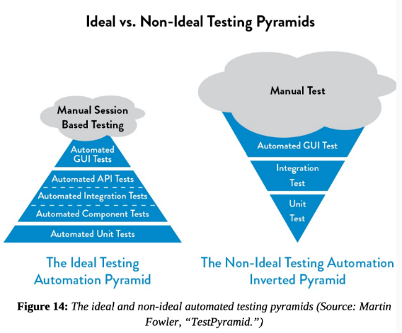

# DevOps

This directory contains all course material for the PBTIN DevOps 2021-2022 course. Below is a summary for the theory exam, and the work for the graded assignments is found in the `opdracht-...` directories. 

**Grade PE:** 55/60

## Samenvatting 

### Introductie DevOps

**Flow van een applicatie**

    • Vanaf het plannen tot live
    • Dev: ontwikkelen van nieuwe feature
    • Dev: unit testen nieuwe code schrijven
    • Dev: installeren dependencies
    • Ops: runnen in testomgeving
    • QA: Functionele testen & Integratietesten, e2e
    • Ops: Deploy naar productieomgeving
    • Feedback: bugs issues, logs, nieuwe features?

**Reflectie**

    • Goede communicatie tussen Dev & Ops?
    • Automatisatie van applicatie flow?
    • Is er single point of truth? 
    • Central beheer van code/configuratie

### Agile, DevOps & the 3 ways

**Dev + Ops**

    • Application performance    --> Application availability
    • End user analytics 	     --> Application Performance
    • Quality code		         --> End user complaints
    • Code level errors	         --> Performance analytics

#### The 3 Ways

**First Way: Create a delivery system**

    • Waterfall (van boven naar beneden)
    • Agile (van boven naar beneden in loops)
    • DevOps (van links naar rechts naar links, altijd in beweging)

*Flow verhogen:*

    • Kleine stapjes, meer releases
    • Minder WiP
    • Makkelijker om fouten te vinden en op te lossen
    • Maakt werk zichtbaarder

*Pipeline maken*

Identificeer de onderdelen die zorgen dat het business idee omgezet wordt in een realiteit, en maak er een pipeline van.

`Sleutelwoorden`: Versiebeheer, automatisch gebouwd, automatisch getest, productie-waardige omgeving

**Second Way: Amplify Feedback Loops**

    • Waterfall (enkel op het einde)
    • Agile (enkel op het einde van de sprint)
    • DevOps (continue te monitoren & testen)

*Continuous Integration*

    • Comprehensive and reliable set of automated tests that validate deployable state
    • Culture that stops entire production line when validation tests fail = no technical debt

**Third Way: Learn & Experiment Continuously**

    • Enable safety
    • Improvement of daily work
    • Local discoveries to global improvements
    • Inject Resilience

#### Differences DevOps with Agile

**DevOps**
 - Technical practice to achieve e2e solution
 - Ops as deployment is small part of ops, other being config management, etc.
 - Aligns Ops with stability, scripting deployment and standardizing app builds

**Agile**
 - More about processes like scrum methodology and sprints
 - Link between Design Thinking and DevOps
 - Aligns development with business priorities, focus on speeding up development process

### Source Control

**Why Source Control?**

    • Single source of truth
    • Samenwerken als team aan dezelfde code
    • Feedback over nieuwe releases van de code
    • Pushing code to a remote, central location

**Waar:**

    • Software Code
    • Infrastructure as Code
    • Tekstdocumenten
    • Git, SVN, TFS

**Branching Strategie**

    • Strategie voor het samenwerken met versiebeheer, verschillende varianten
    • Aftakkingen van de main branch tijdens het ontwikkelen
    • Duidelijke Flow doorheen het ontwikkelproces

**Pull requests**

    • Signaal geven dat code klaar is voor merge
    • Evaluatie van code
    • Communicatie tussen developers
    • Inhoud PR: comments, omschrijving, tags, checkboxes, testomschrijvingen

### Pipelines

`What:` 
 * Ensures that all code checked in to version control is automatically built and tested in a production-like environment.
 * Developers changes are validated by creating a build and running automated tests against the build.

**Continuous Integration**

*Code binnenhalen*

    • Vanuit source control

*Installing dependencies*

    • Afhankelijk van programmeertaal/ omgeving (nmp install, composer install)

*Building software*

    • Automatiseren van het compileren & builden applicatie
    • Afhankelijk van programmeertaal (jar, exe, …)

*Test*

    • Automatische testen m.b.t. code: Code quality, Linting, Unittesten
    • Geen QA omgeving nodig

*Archiving Artifacts*

    • Beheer van paketten:
    • Centraal? Verschillende versies/build?
    • Build once, deploy anywhere

**Continuous Delivery**

A CD pipeline is an automated expression of your process for getting software from version control right through to users and customers

*Deploying Software*

    • Gecompileerde code
    • Omgeving specifieke parameters
    • Dependencies

*Automatiseren van de deploy*

    • Vertrekken vanuit de artifact vanuit de CI pipeline
    • Centrale repository?
    • Omgeving in orde maken: dependencies, secrets, credentials

*Structuur ligt niet vast*

    • Elk bedrijf/omgeving heeft zijn eigen accenten 

*Hoe?*

    • Pipeline tooling bv. Jenkins

### DTAP

**Configuration Management**

    • IP Adressen
    • API endpoints
    • Credentials
    • (test) data
    • Voorlopig manueel
    • Semi-geautomatiseerd

**SSH & sshagent plugin in Jenkins**

    • SSH-authenticatie naar verschillende servers
    • Private & public keys (keygen)
    • Sshagent plugin voor jenkins
    • Gebruik van keys bij ssh commando’s als authenticatie
    • Integratie met credential manager

**Application Release Automation**

`ARA Tools` = Hype Enterprise tooling terminologie

*Application release automation benefits:*

    • Streamlining processes
    • Reducing timelines and decreasing manual tasks
    • Increasing departmental agility and flexibility
    • Improving productivity and collaboration while controlling risk

`Build once, deploy anywhere`

`Applicatie dependencies`

`Oplossing voor elke deploy omgeving`

*Voordelen van applicatie in docker te bouwen*

    • Runs anywhere
    • Dependencies included
    • Promotes immutable infrastructure

**Mutable & Immutable infrastructuur**

*Mutable*

    • Continually updated & patched to meet ongoing needs of purpose it serves
    • Builds a unique history of changes with each update
    • Result: Each service becomes slightly different, leading to configuration drift and bugs

*Immutable*

    • Using Infrastructure as Code to deploy machine images created by Docker
    • Reduces likelihood of configuration drift
    • Automated testing is more effective as an immutable image that passes your tests in test environment is likely to behave exact same way in production
    • Mutable: team needs to be aware of infrastructure history, immutable is better for stateless applications
    • Approach depends on use case, one is not better than the other

*Dockerfiles moet dus NIET:*

    • Fixed versie nummers bevatten
    • Ervan uitgaan dat het toegang heeft tot bepaalde tools
    • Zomaar dingen naar het internet wegschrijven

### Integrated Testing

**Soorten testen**

*Unit testing*

    • Testen van software componenten los van groter geheel
    • Kwaliteitscontrole op code-niveau
    • Bewijs dat code doet wat die zou moeten doen

*Integratie testen*

    • Integraties met andere software
    • Meestal via API’s
    • Suites zijn uitbreidbaar met test scripts
    • Diepere controle op gemaakte requests/responses
    • Pass/fail net zoals bij andere testen

*Postman test collection*

    • Bundeling van requests op urls met headers/content/body
    • Automatische inventarisatie van de response
    • Mogelijk om de volledige suite in een keer te runnen 
    • Eenvoudige import/export features
    • Testen op response code + body
    • Testen op inhoud response

*Functionele E2E testen*

    • Testen van UI
    • Applicatie moet functioneel zijn
    • Applicatie wordt getest als sub geheel, niet meer als losse code-componenten
    • Selenium IDE: Lightweight add-on om E2E testen te schrijven (.side files)
    • Bundeling van testen = test suite

*Continuous quality in een pipeline*

    • Testen runnen vanuit een pipeline
    • CLI omgevingen
    • Integratie met externe systemen (API’s?)
    • Functionele testen
    • Selenium CLI

*Non-functional testen*

    • Performance testing tools
    • Front-end testing web apps: Lighthouse, Webpagetest

### Monitoring & Reporting

**Metrics**

    • Meetpunten, dingen zoals:
    • Temperatuur van SDD’s
    • CPU percentage
    • Netwerksnelheden
    • IO van een HDD
    • Prigramma logging
    • Netwerk logging

**Logging**

    • Var/log/syslog
    • Var/log/kern
    • Windows: Event viewer
    • *nix: Cockpit, webmin

**Log aggregatie**

    • ELK stack
    • Graylog/Nagios Log server
    • Splunk

**Monitoring History**

`Simple Network Monitoring Protocol (SNMB)`

`Management Information Base file (MiB)`

**Monitoring History**
Volgende generatie ging ook iets met de monitoring data doen: Alerting Tools zoals:

    • PRTG
    • Nagios
    • Check_mk

**Monitoring Tools**

    • Pingdom
    • Freshping
    • Uptimerobot

**Doel van Logging:**

    • Generating real-time feedback
    • Applicaties updaten brengen extra uitdagingen met zich mee
         - Downtime tijdens update
         - Bugs
         - Rollback is niet eenvoudig
         - Alles of niets
    • Naast klassieke monitoring van servers, services, logs, monitoren in functie van deployments
    • Low Risk Releases

**Lower risk releases**

    • Classic deploys
         - Pros: Simple, Fast, Cheap
         - Cons: Risk, outages, slow rollback, unemployment
    • Rolling deploys
         - Pros: Simple, cheap, relatively easy to rollback, less risk than basic deployment
         - Cons: App/DB needs to support both new and old artifacts, manual checks could take long time
    • Blue/Green deploys
         - Pros: Simple, Fast, Less Risk, Rapid Rollback
         - Cons: Complex and expensive, coverage may not identify all anomalies
    • Canary deploys
         - Pros: deploy in small phases, test in production with real users, cheaper than blue/green and safe RB
         - Cons: Scripting canary deployments can be complex, Required monitoring for testing in production
    • A/B Testing
         - Pros: Fast, easy, cheap way to test features
         - Cons: Experimenting can break app/service, Scripting A/B Tests can be complex

