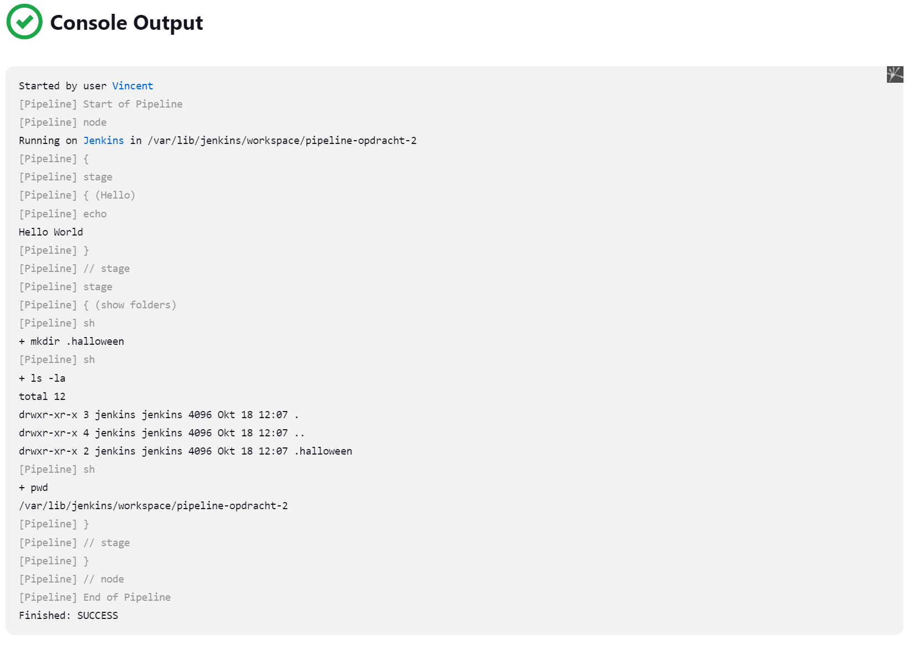
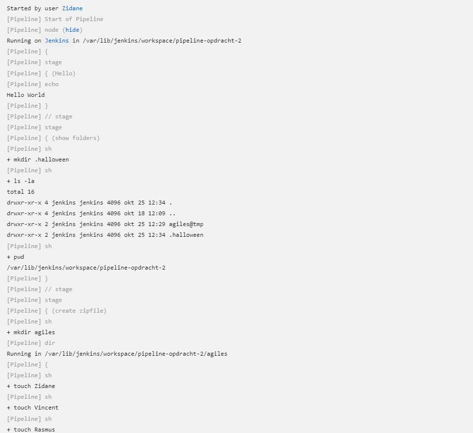
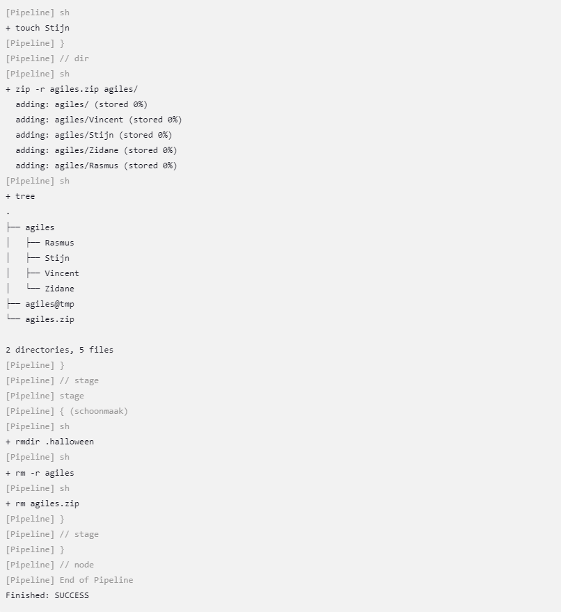
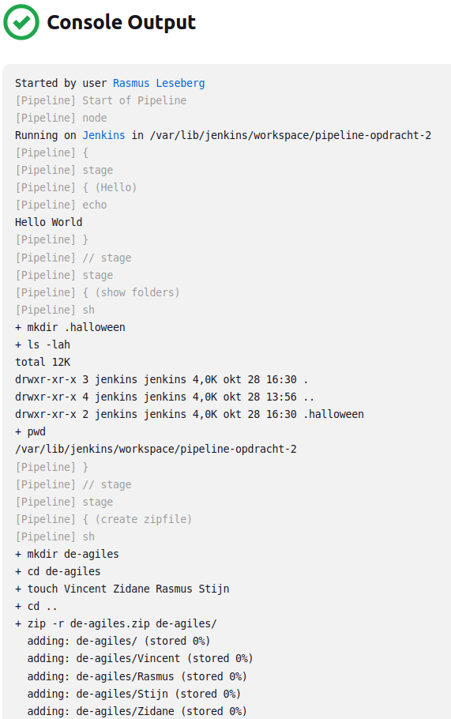
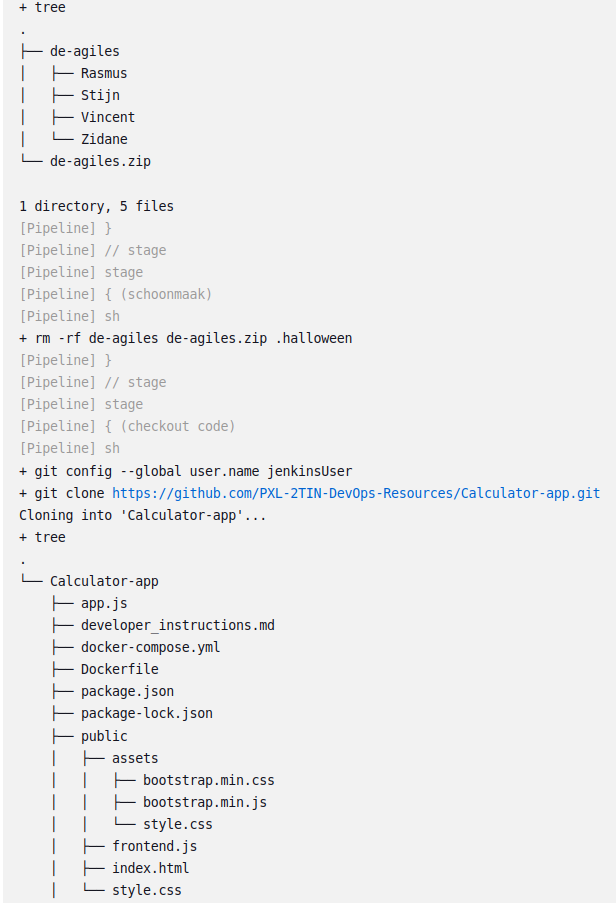
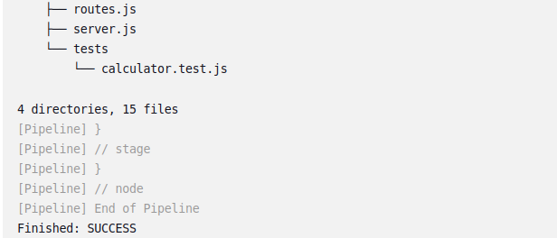
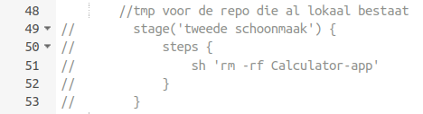
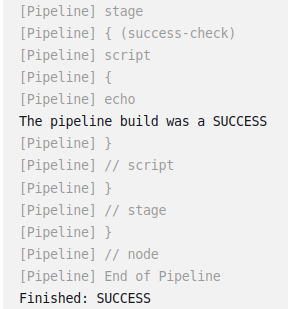

# Opdrachten en hun oplossing

## a) Voer de pipeline succesvol uit met het het bewijs van een werkende pipeline a.d.h.v. de console output

   

## a) alternatief: sh ''' voor scripts met meerdere cmd's

   Code: 
	
	    //folder stage
            stage('show folders') {
            	steps {
                   sh '''
                      mkdir .halloween
                      ls -lah
                      pwd
                  '''
            	}
            }
 	

## b) Voer de pipeline succesvol uit  van de 'zipfile stage', met het het bewijs van een werkende pipeline a.d.h.v. de console output 

   
   

## b) alternatief: beknopte stage code door sh '''

   Code: 

	//zipfile stage
        stage('create zipfile') {
            steps {
                sh '''
                    mkdir agiles
                    cd agiles
                    touch Vincent Zidane Rasmus Stijn
                    cd ..; zip -r agiles.zip agiles/
                    tree
                '''
            }
        }
        //schoonmaak stage
        stage('schoonmaak') {
            steps {
                sh 'rm -rf agiles agiles.zip .halloween'
            }
        }

## c) Voer de pipeline succesvol uit van de 'checkout code' stage, met het bewijs a.d.h.v. de console output:

   
   
   

## Opdracht 6:

   Note:

	Er is een tweede schoonmaak stage voorzien in de pipeline
	die de repo verwijdert, om ervoor te zorgen dat de build niet faalt
	door de reeds bestaande repository. Die stage staat in commentaar en is 
	te zien in de eerste afbeelding.

	De tweede afbeelding is de script code die gebruikt wordt voor de build, 
	en de derde afbeelding is de console output.

#### Afbeelding 1

   

#### Afbeelding 2

   

#### Afbeelding 3

   
