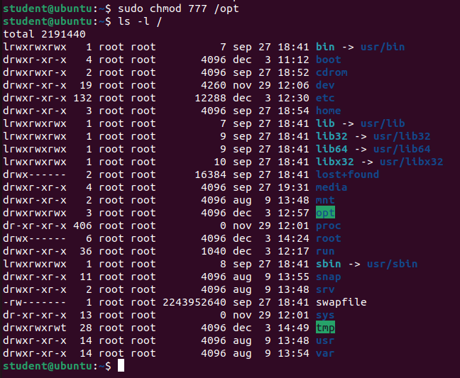
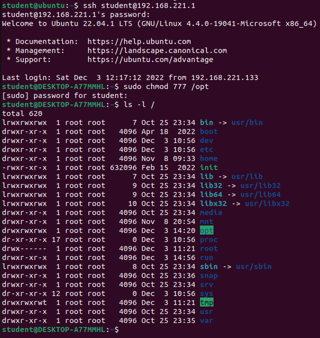
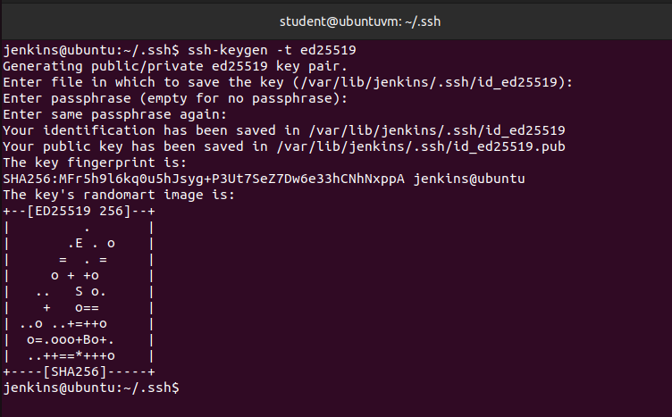
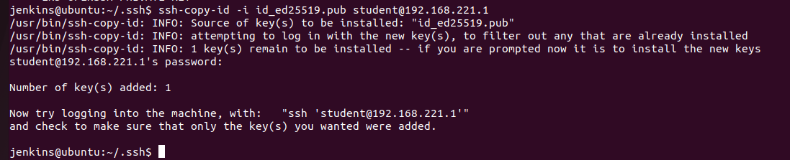
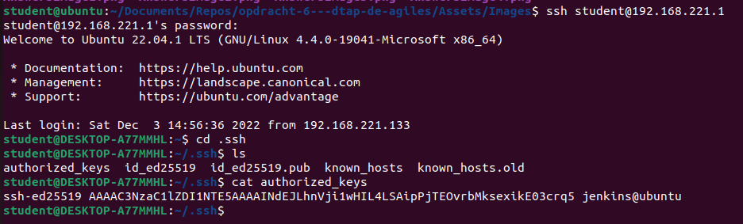
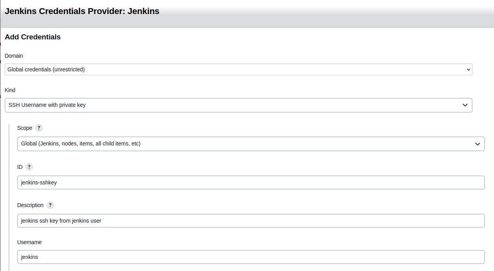
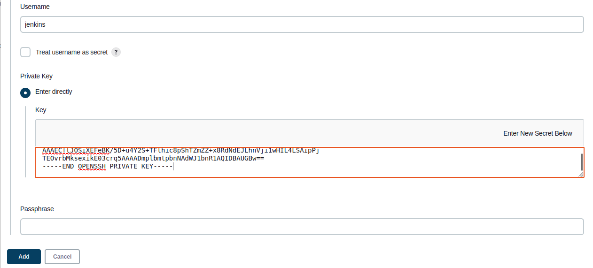

Vul onderstaande aan met de antwoorden op de vragen uit de readme.md file. Wil je de oplossingen file van opmaak voorzien? Gebruik dan [deze link](https://github.com/adam-p/markdown-here/wiki/Markdown-Cheatsheet) om informatie te krijgen over
opmaak met Markdown.

# Opgave 6 oplossing

## punt a) Uitleg over rechten geven en SSH Credential Management

Om te beginnen gaan wij de juiste rechten op de /opt folder instellen, zodat het mogelijk is om executables uit te voeren binnen deze directory. Ook al is het niet normaal de bedoeling om '777' als chmod in te stellen, doen wij dit voor deze keer wel: 

    Stappenplan:
        - Binnen je test-server doe je: sudo chmod 777 /opt
        - Na het ingeven van je wachtwoord staan de rechten op rwx voor iedereen
        - Op je productie-server doe je hetzelfde
        - Met ls -l /opt controleer je dat alle rechten gegeven zijn
        - Als je drwxrwxrwx ziet bij de /opt dir, dan is het juist

   

   

### SSH keys instellen, op hun plaats zetten, en de Jenkins Credentials manager

Om de SSH connectie te leggen vanuit onze test server naar de productie server, moeten eerst de SSH credentials in orde zijn. Het stappenplan loopt als volgt:

    Stappenplan:
        - Verander naar de jenkins user op de test server met: su jenkins
        - Als je het wachtwoord kwijt bent van de user, switch naar root en stel het ww opnieuw in
        - Genereer een ssh-key met: ssh-keygen -t ed25519
        - Doorloop de SSH-keygen stappen
        - Kopier deze key naar de productieserver met: ssh-copy-id -i id_ed25519.pub <user>@<ipadress-prod-server> (vanuit .ssh dir)
        - Om te kijken of de key succesvol is gekopieerd is het mogelijk om naar de authorized_keys fodler te kijken op de prod-server

   

   

   

#### Jenkins Credential manager

Op Jenkins is het nodig om de juiste plugins te installeren. De plugins die geinstalleerd moeten zijn:

    - SSH Agent Plugin
    - Copy Artifact Plugin (voor later)

Om in ons pipeline script gebruik te kunnen maken van een ssh connectie kunnen we pipeline syntax genereren a.d.h.v de SSH-Agent. 
Belangrijk is wel dat wij een ssh-agent geconfigureerd hebben in de credentials manager. 

    Stappenplan:
        - Bij het pipeline script druk je onderaan op "Pipeline Syntax"
        - Bij het "Sample Step" dropdown selecteer je "sshagent: SSH-Agent"
        - Je klikt op Add
        - Domain blijft op "Global Credentials (unrestricted)" staan
        - Kind stel je op "SSH Username with private key" in
        - Je geeft deze credential een id, die we later gaan gebruiken in de script
        - Je geeft de credential een omschrijving
        - De username die wij gaan instellen is 'jenkins'
        - De private key voeg je direct toe, die is te vinden op je machine in de dir .ssh
        - Indien nodig, vul de passphrase in, anders laat je die open
        - Add
    
   
   

Nu zou het mogelijk moeten zijn om bepaalde cmd's uit te voeren a.d.h.v. de SSh-Agent plugin. Een voorbeeld daarvan zou er als volgt uitzien: 

    sshagent(['jenkins-sshkey']) {
        sh 'ssh <username>@<ip-prod-server> unzip /opt/bundle.zip -d /opt/'
    } 

De "['jenkins-sshkey']" die hier wordt gebruikt is het ID wat in de credentials manager werd ingesteld. 

### NOTE
Om goed gebruik te kunnen maken van onze nieuw ingestelde credential, kunnen we de public key van de jenkins user lokaal verwijderen, omdat die opgeslagen staat bij de jenkins credential manager.

## punt b) Uitleg over het "Configuratie management"

Nadat de publieke repository is aangemaakt, moeten wij de css bestanden binnen de test pipeline binnen halen, zodat wij die kunnen gebruiken in de config stage. Het stappenplan: 

    Stappenplan: 
        - Nadat de unittest stage is uitgevoerd in de test pipeline halen wij de code binnen van de publieke repository 
          a.d.h.v. een nieuwe stage.
        - In de 'Config env' stage replacen wij het style.css bestand van public/style/assets met ons nieuw css bestand
        - In de test omgeving kan dit eenvoudig vanuit de huidige dir, en in de productie omgeving halen wij het bestand 
          vanuit de test omgeving binnen a.d.h.v. 'scp', en zetten die op de juiste plaats.

#### Test omgeving:

    stage ("Config env") {
            steps {
                sh 'rm -rf /opt/bundle/public/assets/style.css'
                sh 'mv Test.style.css /opt/bundle/public/assets/style.css'
            }
        }

#### Productie omgeving:

    stage ("Config env") {
            steps {
                sshagent(['productionCredentials']) {
                    sh 'ssh ${PRODUCTION_SERVER_USER}@${PRODUCTION_SERVER_IP} rm -rf /opt/bundle/public/assets/style.css'
                    sh 'scp Prod.style.css ${PRODUCTION_SERVER_USER}@${PRODUCTION_SERVER_IP}:/opt/bundle/public/assets/style.css'
                }
            }
        }

