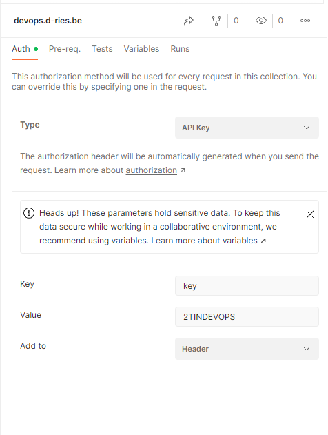
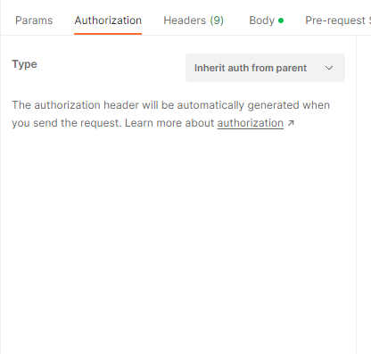
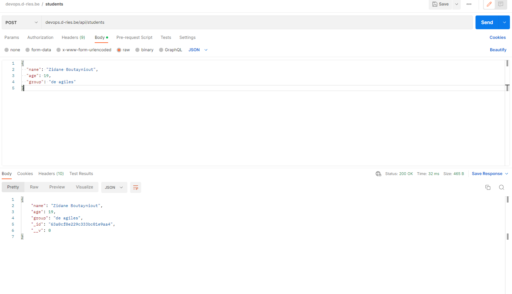
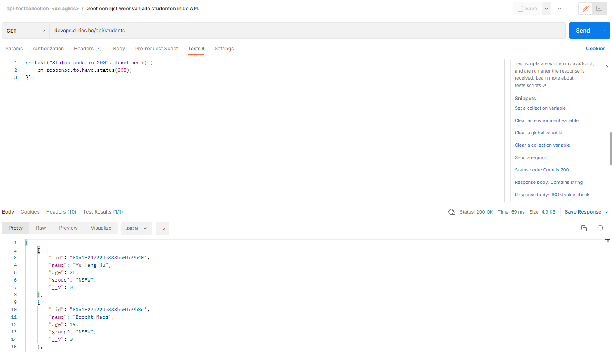
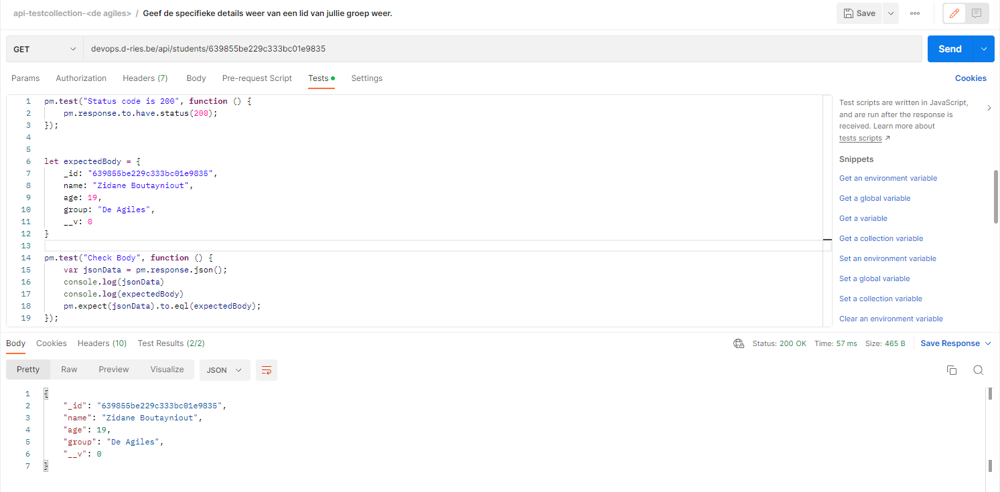
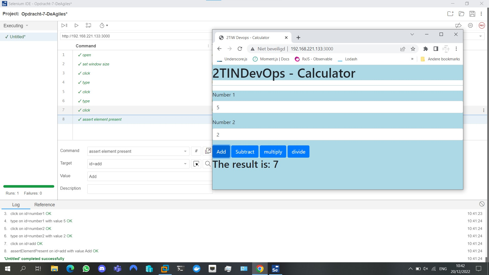
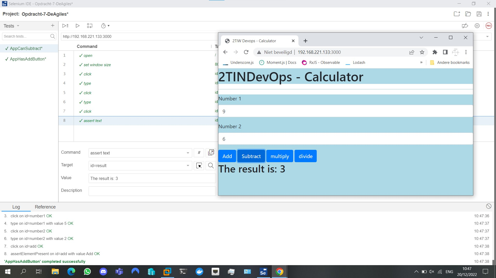

Vul onderstaande aan met de antwoorden op de vragen uit de readme.md file. Wil je de oplossingen file van opmaak voorzien? Gebruik dan [deze link](https://github.com/adam-p/markdown-here/wiki/Markdown-Cheatsheet) om informatie te krijgen over
opmaak met Markdown.

Kennismaking API
----
Na de installatie van Postman kunnen we aan de slag gaan.
voor de authenticatie maakten we eerst een nieuwe collection en voegden we in de Authenticatie tab het volgende in:

   -Voor type kiezen we `API key`

   -voor Key vullen we `key` in 
   
   -voor Value vullen we `2TINDEVOPS`
   
   -voor Add to kiezen we `Header`

Alle requesten onder deze collection overerven de Authenticatie key door het Type intestellen als `Inherit auth from parent` zodat je het niet altijd zelf moet instellen.

Om ervoor te zorgen dat ieder teamlid zichzelf kan toevoegen in de API in postman moeten we een POST request aanmaken en de gepasten request url te typen.
Hierna pas je de volgend stappen toe:

   -Ga naar de Body tab en kies de optie `raw`
   -dan kies je `JSON` van de text drop down.
   -kopieer de juiste body object die je kan terugvinden in Swagger en paste het in de body van Postman.
   -vul nu de gepaste informatie in de body en klik `SEND`
   

----

# a) Integratie testen met postman
---

Om de API te testen beginnen we met een collection toe te voegen met de naam `api-testcollection-<de agiles>`. 
Daarna stellen we de Authenticatie tab in hoe we het in de vorige puntje `Kennismaking API` hebben gezien.

Eerst testen we of we een lijst kunnen weergeven van studenten met API. Hiervoor voeren we de volgenden stappen uit.

   1.Eerst voegen we een nieuwe request toe.
   
   2.Kies een GET request en vul het correcte request url in: `devops.d-ries.be/api/students`
   
   3.Ga naar de test tab en zoek in de snippets `Status code: code is 200`.
   
   4.Klik SEND.
   

Deze test kijkt of we een Status code 200 krijgen, dit betekent dat het succesvol was.

De tweede test gaan we kijken of we succesvol specifieke gegevens van iemand van onze groep kunnen krijgen. Hiervoor doen we het volgenden.

   1.We voegen een nieuwe GET request toe.
   
   2.We vullen het correcte request url in die de id opvraagt van een lid van onze groep: `devops.d-ries.be/api/students/639855be229c333bc01e9835`
   
   3.Daarna gaan we naar de test tab en voegen we terug de `Status code: code is 200`

Voor deze test kunnen we ook testen of de body die we terug krijgen wel het correcte body is.
Dit hebben we als volgt gedaan.

---
b) Selenium IDE - end to end testen
----
Binnen Selenium is het mogelijk om de flow van de applicatie te 'recorden', om testen te laten genereren. Daarna is het mogelijk om deze testen aan te vullen met extra stappen binnen de Selenium IDE. Het stappenplan is: 

   - Zorg ervoor dat de applicatie gedeployed is, en toegankelijk is via <ip>:<port>
   - Binnen Selenium IDE (Chrome extension in ons geval) een nieuw project opnenen
   - Boven rechts op de "REC" knop drukken, die de volgende stappen zal recorden
   - Voor de eerste test case testen wij of de applicatie een ADD button heeft, dus geven we twee getallen in, en drukken op 'Add'
   - De recording stoppen door weer op de "REC" knop te klikken.
   - Om te testen of er effectief een 'Add' button aanwezig is, gaan wij een extra stap toevoegen: 'assert has element', daarna het button element selecteren met de hulp van het vergrootglasicoon bij 'Target' binnen de IDE
   - Bij 'Value' kunnen wij 'Add' toevoegen
   - Nu wordt effectief getest of er een Add Button aanwezig is binnen de applicatie. Op onderstaande screenshot is te zien hoe de test verloopt.

Bij de volgende test moeten we kijken of het aftrekken van waardes ook lukt. Het stappenplan:

   - Een nieuwe test toevoegen door linksboven bij Tests op '+' te klikken
   - Naar de naamgeving van de test verlopen wij opnieuw de record stappen van net, alleen nu met de subtract button
   - Bij de laatste stap gaan wij niet testen of de subtract button aanwezig is, maar eerder dat het resultaat juist is. Wij kunnen hiervoor 'assert text' gebruiken, de resultaat textbox selecteren, en asserten of de uitkomst aan text overeenkomt met het verwachte aantwoord. 
   - Op de screenshot is te zien hoe de test verloopt. 

De file kan nu worden gesaved als een .side file
