Vul onderstaande aan met de antwoorden op de vragen uit de readme.md file. Wil je de oplossingen file van opmaak voorzien? Gebruik dan [deze link](https://github.com/adam-p/markdown-here/wiki/Markdown-Cheatsheet) om informatie te krijgen over
opmaak met Markdown.

# Opgave 5 oplossing

## punt a) 

Omdat we vanaf 13/08/2022 geen gebruik meer kunnen maken van username password authenthicatian op git.
Gaan we gebruik maken van een ssh key.

    Stappenplan ssh authentication git:
        -  Maak een nieuwe ssh key aan op je eigen computer met het commando: ssh-keygen -t ed25519
            -  3 x "Enter"
        -  Copy de ~/.ssh/id_ed25519.pub key
        -  Voeg deze key toe aan je Github account
            -  Ga naar Settings -> SSH and GPG keys -> New SSH key
            -  Klik op "New SSH key"
            -  Geef de entry een Title bijvoorbeeld "Jenkins" 
            -  Paste de key in het tekstvlak
            -  Add the SSH key
        - Ga naar de Credential Manager in Jenkins
            - Klik op "Jenkins" -> "Manage Jenkins" -> "Manage Credentials" -> "System" -> "Global credentials" -> "Add Credentials"
            - Kies "SSH Username with private key"
            - Geef de credential een username bijvoorbeeld je github username
            - Geef de credential de private key ~/.ssh/id_ed25519
            - Klik op "OK"
        - Omdat de jenkins user dit ge host key nodig heeft gaat de eerste connection niet werken. We kunnen dit oplossen door een instelling te veranderen die de eerste connectie zonder host key accept.
            - Klik op "Jenkins" -> "Manage Jenkins" -> "Configure Global Security"
            - Verander de "Git Host Key Verification Configuration" naar "Accept first connection"
        - Je kan eventueel de keys die je op de host hebt gegeneerd verwijderen omdat we deze niet meer nodig hebben.
              - Command: rm ~/.ssh/id_ed25519*

Je pipeline definition hoort er dan zo uit te zien:

    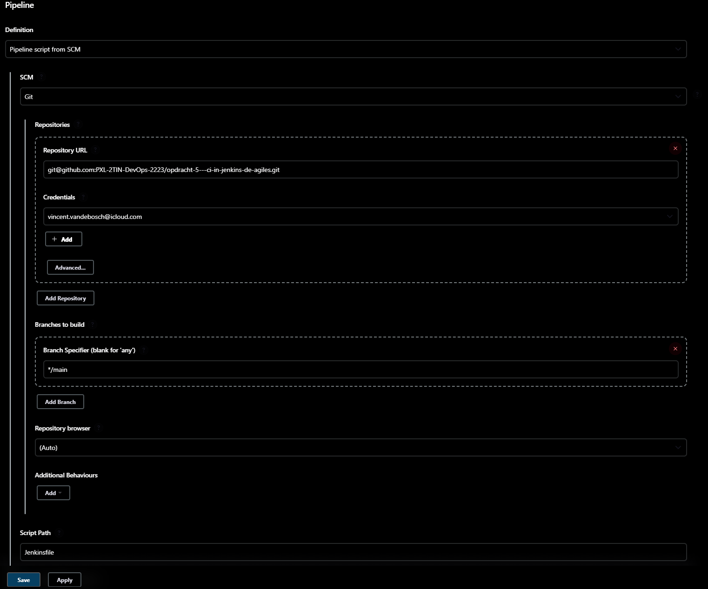


De stage 'checkout code' heb ik als volgt gedaan.
    
    pipeline {
        agent any
        stages {
            // Opdracht a
            stage('checkout code') {
                steps {
                    git branch: 'main', url: 'https://github.com/Vincevdb1/calculator-app-finished.git'
                }
            }
        
            // clean up
            stage('clean up') {
                steps {
                    cleanWs()
                }
            }
        }
    }

Ik besloten de 'checkout code' te doen zonder gebruik te maken van de credential manager omdat de fork van de calculator app een public repository is en omdat mijn teamgenoten geen gebruik kunnen maken van de credential manager variabelen van mijn systeem.

Zou de repo private zijn geweest en/of zouden mijn teamgenoten toegang hebben tot de credential manager van mijn systeem dan had ik het volgende commando gebruikt:

    git branch: 'main', credentialsId: '1571bede-2229-46c4-a593-7573e3c134a4', url: 'https://github.com/Vincevdb1/calculator-app-finished.git'


## punt b)

Om de nodejs configuratie in de global tool configuratie van jenkins toetevoegen, moeten wij eerst een NodeJS plugin installeren, waarna de mogelijkheid te voorschijn komt om de global configuration tool aan te passen.

Eerst gaan wij de NodeJS plugin moeten installeren: 
	
    Stappenplan voor de plugin installatie en configuratie

	- Bij Jenkins Dashboard --> Links onder: Manage Jenkins --> Onder 'System Configuration' --> Manage plugins
	- Selecteer de 'Available' tab --> zoeken voor de plugin met 'nodejs' --> NodeJS plugin installeren
	- Bij Jenkins Dashboard --> Manage Jenkins --> Onder 'System Configuration' --> Global Tool Configuration
	- Scrool down tot 'NodeJS'
	- Add NodeJS
	- bij Name: geef in 'nodetin'
	- 'Install automatically' is aangevinkt dus default instellingen blijven staan
	- Save

In de screenshot is het te zien hoe de default instellingen eruit zien:

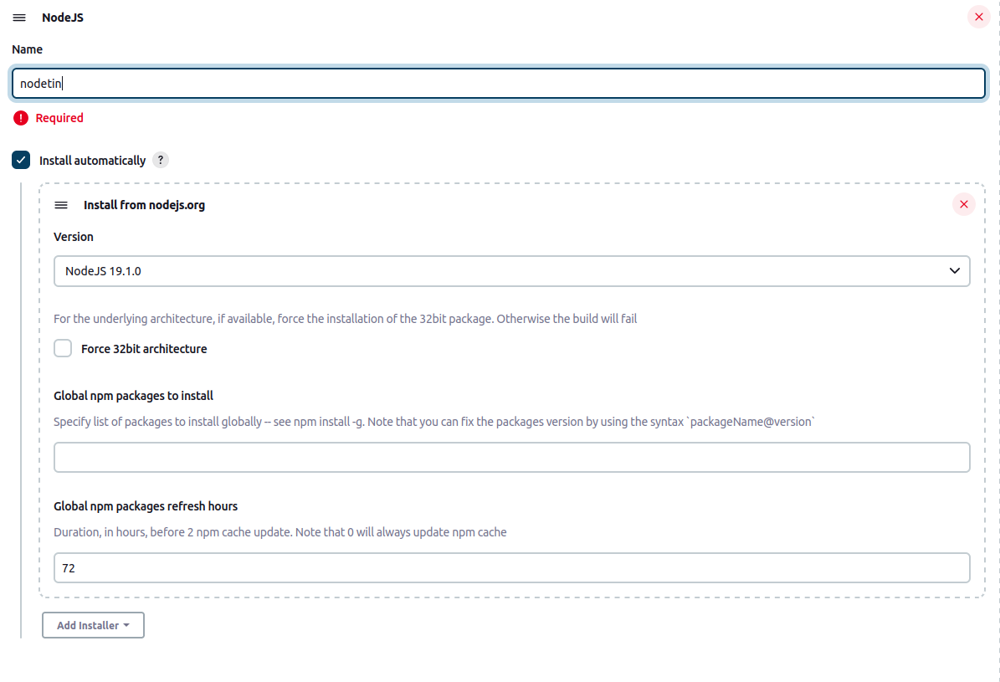


## punt c)
Na de configuratie van ´nodejs´ in de global tool configuration kun je de benodigde ´npm´ dependencies installeren als volgt:

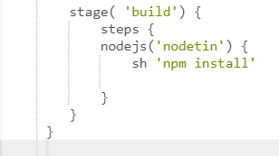

In de stage unittesten kan je testen uitvoeren met het commando `npm test`. Om de testen te kunnen rapporteren aan de huidige built kun je de volgende syntax gebruiken:

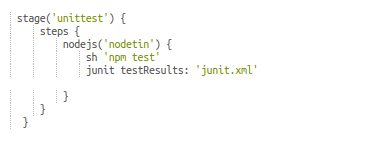

In de Build zelf kan je de rapporten op verschillende plaatsten vinden. Dit zit er als volgt uit: 

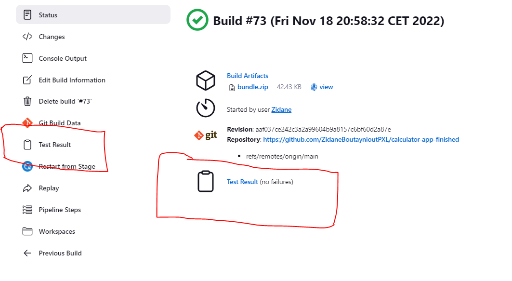


In de create bundle stage maak ik de folder bundle aan en kopieer ik de nodige files om de applicatie te laten runnen naar bundle. Dan zip ik het bestand met het volgende syntax:

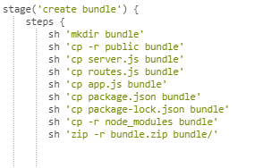

Als de pipeline faalt moet er een nieuwe file worden gemaakt met als message “pipeline poging faalt op <datum + tijd>”, en moet dit weggeschreven zijn naar de homefolder van de Jenkins user. Dit heb ik als volgt gedaan:

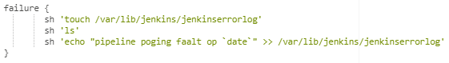

In de console log ziet dit er als volgt uit:

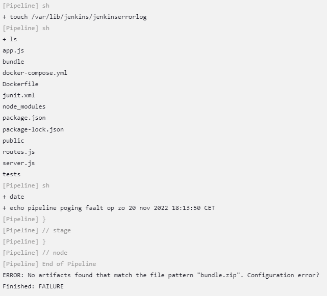

Als de pipeline succesvol is verlopen moet ik het zip bestand uit stap 7 archiveren als artifact. De build moet ook meerdere malen succesvol kunnen verlopen waardoor ik bij deze stap ook de nodige folders verwijdert:

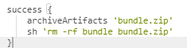

Zo ziet de Artifact eruit in de build:

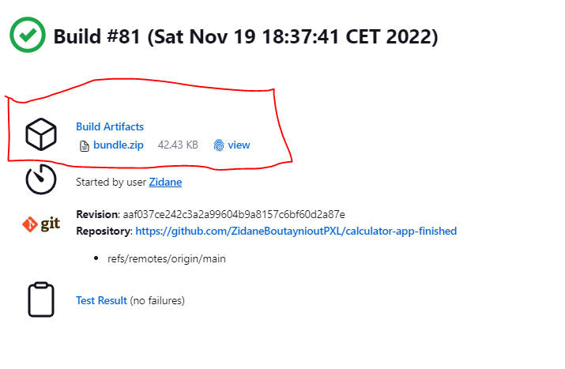

En hier nog het bewijs dat de build meerdere malen na elkaar succesvol kan verlopen

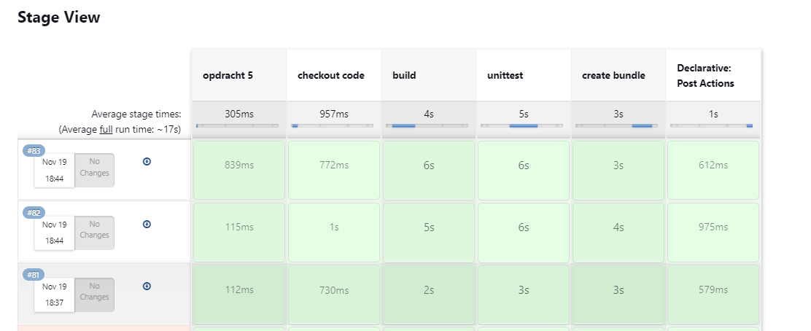


## punt d)

Om een jenkins pipeline elke vrijdag om 14:00 te laten runnen vinken we Build Periodically aan in de configuration van de pipeline, hier vullen we een zogehete "cron" expressie in. :
```0 14 * * 5``` waarmee in chronologische volgorde de minuten, het uur, de dag van de maand, de maand en de dag van de week worden aangeduid.  

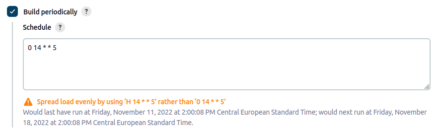  

Hierdoor krijgen we wel een waarschuwing dat we hiermee de load niet gelijk verdelen. Jenkins stelt voor dat we ```H 14 * * 5``` gebruiken. Deze ```H``` zorgt ervoor dat verschillende jobs met dezelfde cron settings niet allemaal op precies hetzelfde moment runnen. Voor onze situatie is dit niet van toepassing dus negeren we deze melding. Als je een declarative opbouw hebt van je jenkins file, kun je ook de 'triggers' directive gebruiken hiervoor. voorbeeld:  

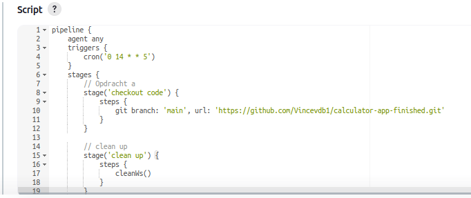  

De pipeline runt nu, na het eenmaal uitvoeren van het script, automatisch elke vrijdag om 14:00.
