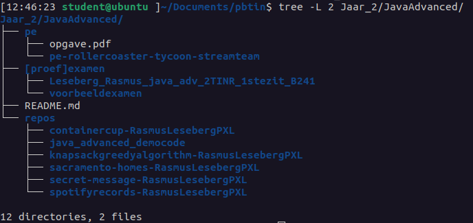

# Java Advanced

### Year: 2022-23

This directory contains exercises from the Java Advanced course from PBTIN year 2022-23. The directory contains: 

    * pe (Rollercoaster tycoon simulation)
    * exam ([proef]examen)
    * repos

`repos` contains all assignments given throughout the year in the form of repositories. The `[proef]examen` dir contains a practice exam and the final exam of that year.

**Exam Score:** 16

**PE Score:** 2.96/4

#### Directory contents:

