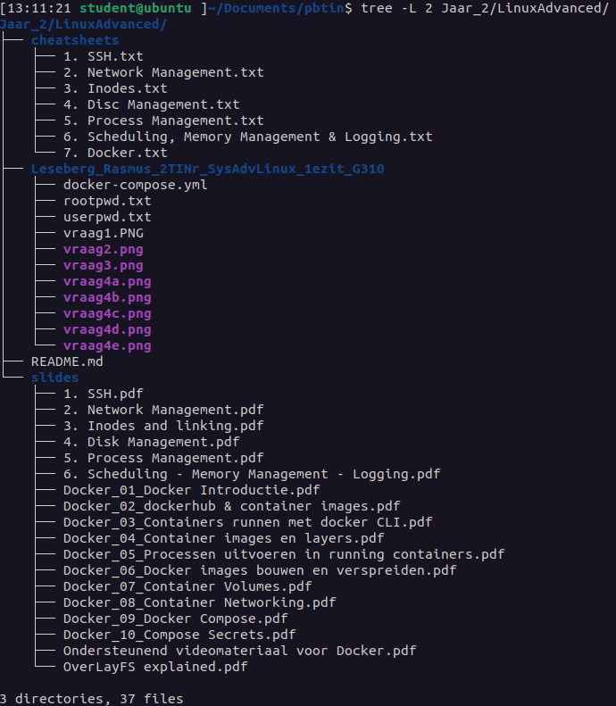

# Linux Advanced 

### Year: 2022-23

This directory contains exercises from the Linux Advanced course from PBTIN year 2022-23. The directory contains: 

    * cheatsheets for all chapters
    * exam
    * slides

`cheatsheets` contains command cheatsheets for every chapter, including the excercises for those chapters. the `7. Docker.txt` file in the cheatsheets dir contains all cmds for Docker, and exercises from the slides Docker_01 --> Docker_10. 

The exam directory contains all relevant exam files, including screenshots that were asked on the exam.

**Exam Score:** 16

#### Directory contents:

